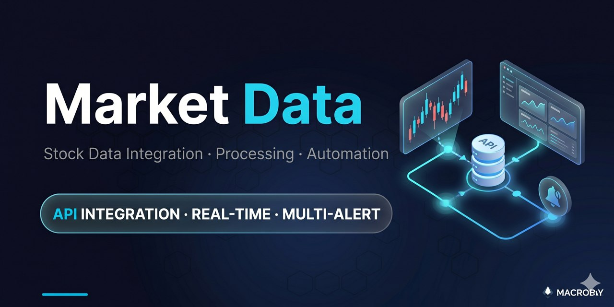
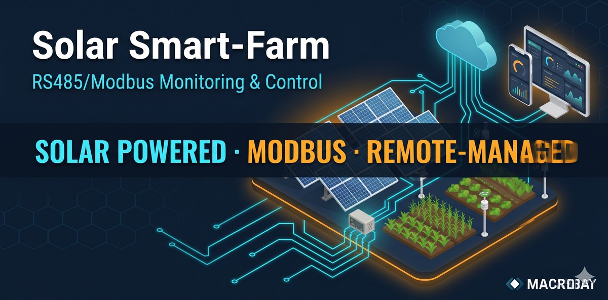
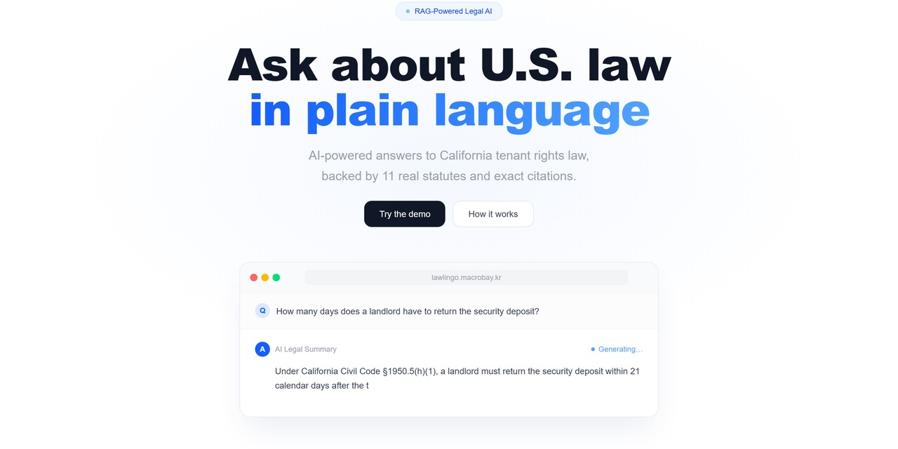

  🌐 <strong>한국어</strong> | <a href="./README.en.md">English</a>

  

# MACROBAY — Systems Architecture for SMBs & Founders

> **"기술 사양을 몰라도 괜찮습니다. 메모·사진·문서·음성 뭐든 주시면 정리해서 방향 제안드리고, 확인 후 빌드합니다."**
>
> *"You don't need a tech spec — just tell me what you want to achieve. I'll organize it, confirm direction, then build and deliver."*

**1인 사업자 · End-to-End 시스템 설계 및 빌드 · 25년+ 실무**
**MACROBAY · Solo Studio · South Korea · Remote Worldwide**

**MACROBAY** — IT Solutions by JuneBay

---

## 📍 외주 활동 중 / Available For Projects

> 4개 플랫폼에서 동시에 외주 받고 있습니다. 보통 **24시간 안에** 답변드립니다.
> Active on 4 freelance platforms — typical response time **within 24 hours**.

---

## 누구인가 / Who We Are

**MACROBAY는 1인 시스템 아키텍처 스튜디오입니다.**
- 25년 이상 시스템 설계·운영 경험 (금융, AI, IoT, 지리정보, 자동화)
- 코드만 짜는 게 아니라 **"비즈니스 목표 → 작동하는 시스템"** 까지 책임
- $0 인프라 / 3년+ 무중단 운영 / 성능 최적화 등 실제 운영 결과 보유
- **"이론적 완벽함보다 현실 운영 가능성"** — 비용·운영 지속성 우선 설계

**MACROBAY is a 1-person systems architecture studio**, founded by a senior architect with 25+ years across finance, AI, IoT, geospatial, and automation. We focus on **operational sustainability over theoretical perfection** — building systems that survive in production at sustainable cost.

🌐 **Portfolio site**: [macrobay.kr](https://macrobay.kr)

---

## 어떤 작업을 받습니까 / What We Build

| # | 카테고리 | 대표 결과물 | 핵심 기술 |
|---|---|---|---|
| 1 | **AI 자동화 파이프라인** | WhatIF Factory: 멀티모델 영상 자동화, 비용 최적화 설계 | GPT-4o · Gemini · Runway · Veo · ElevenLabs · n8n |
| 2 | **금융·증권 데이터 시스템** | 증권사 API 데이터 통합·수집·가공 자동화, 실시간 대시보드·다중 알림 (자동매매 미포함) | Python · 증권사 API · WebSocket · SQLite · FastAPI |
| 3 | **지리정보 / 결정 지원** | MyLandManager: $0 인프라, 100MB+ 처리 | Leaflet · Turf.js · VWorld API · Vercel |
| 4 | **IoT 원격 모니터링** | FarmStudio: $0 서버, >99% 전송률, 3년+ 운영 | ESP32 · SMTP/IMAP · OTA 펌웨어 · 자가복구 데이터 |
| 5 | **데이터 수집 / 크롤링 자동화** | 공공데이터·공개 소스 수집 (공공 API · 정적/동적 웹) · 다중 계정 이메일 통합 · OAuth 토큰 자동 갱신 · ToS 준수·rate-limit 배려 | Playwright · BeautifulSoup · imaplib · MSAL OAuth2 |
| 6 | **업무 자동화 / 어드민 / CRM** | 알림 봇, 일일 리포트, AI 분류 파이프라인 | Python · n8n · Telegram Bot API · Flask |
| 7 | **LLM 파이프라인 · AI 에이전트** | 문서 자동 구조화(Structured Outputs), 멀티스테이지 모델 라우팅으로 API 비용 최적화, 업무 자동화 에이전트 | OpenAI GPT-4o · Claude · Gemini · FastAPI · PostgreSQL · Redis · BullMQ |
| 8 | **ERP · 업무 시스템 구축/연동** | 맞춤형 ERP (입고·재고·판매·정산) · 구매·정산 자동화 AI 에이전트 · 솔루션 간 무손실 데이터 연동 | FastAPI · MSSQL · PostgreSQL · OpenAI Function Calling · LangGraph · openpyxl · APScheduler |
| 9 | **커머스 · 오픈마켓 통합 / 예약 연동** | 5대 오픈마켓 주문 통합수집 → 상태 정규화 → 3PL 연동 (멱등·멀티테넌트 키 암호화) · 실시간 예약 연동 (선점 락·원자적 확정) | NestJS · TypeORM · MongoDB · PostgreSQL · Mongoose |
| 10 | **어드민 · 백오피스 대시보드** | 근무평가·게시판/광고·키워드·유동인구 백오피스 (RBAC·RLS·차트·엑셀 · **폐쇄망 Docker 납품**) | Next.js · Supabase · Recharts · xlsx |

→ 각 카테고리에서 **작은 모듈 (1주 이내)** 부터 **풀스택 시스템 (1~3개월)** 까지 받습니다.
→ **10+ 개의 라이브 서비스가 [macrobay.kr](https://macrobay.kr) 에서 실제로 돌고 있습니다.**

---

## 진행 방식 / How We Work

1. **무엇을 원하시는지 어떤 형식이든 보내주세요**
   메모, 사진, 문서, 스케치, 음성 메모 — 형식 무관
2. **24시간 내에 정리해서 방향 제안드립니다**
   기술 스택·일정·예상 비용·산출물 명확히
3. **방향 확정 후 빌드 시작**
   매일 또는 주 1회 진행 공유 (계약 시 협의)
4. **운영 매뉴얼 + 인계물 함께 전달**
   단순 코드 납품이 아닌, **운영 가능한 시스템** 으로 인계

---

## 대표 프로젝트 4개 / Featured Projects

각 프로젝트의 케이스 스터디는 [`projects/`](./projects/) 폴더에 있습니다.

### 🎬 [WhatIF Factory / Content Factory](./projects/content-factory.md)

**AI 콘텐츠 자동화 파이프라인 · 멀티 LLM 오케스트레이션**

- 멀티모델 파이프라인 기반 저비용 영상 제작 (수작업 대비 큰 폭의 비용 절감)
- 파이프라인 자동화로 일일 생산량 대폭 증가
- **20개 언어 자막** 자동 로컬라이제이션 (YouTube)
- 5+ 인 팀 → **1인 감독 시스템**
- GPT-4o, Gemini, Runway ML, Google Veo, ElevenLabs 통합
- **2개 YouTube 채널** 운영 중

→ [케이스 스터디 보기 →](./projects/content-factory.md)

---

### 🗺️ [MyLandManager](./projects/land-manager.md) — v6.0

**서버리스 지리정보 결정 지원 시스템**

- 인프라 비용 **$0** (Vercel + 정부 OpenAPI, 순수 클라이언트 사이드)
- **100MB+ 지적도 데이터** 브라우저 청크 로딩
- 분쟁 위험 사전 시뮬레이션
- 수기 작업 시간 **80% 단축**
- 정부 포털(토지이음, 인터넷등기소) 통합

→ [케이스 스터디 보기 →](./projects/land-manager.md) · [라이브 서비스](https://landmanager.co.kr) · [데모](https://my-land-manager.vercel.app)

---

### 💹 [Market Data Systems](./projects/market-data.md)

**증권·금융 데이터 통합 · 2차 가공 · 자동화 — 수집부터 실시간 대시보드·알림까지 (25년+ 금융 실무)**

- 증권사 API(키움 등) 데이터 통합·수집 자동화 (REST/WebSocket)
- 계좌·종목·시장 데이터 → 파생 지표 2차 가공 (정렬·합계·비중·증감률)
- 실시간 대시보드 (PC/모바일) + 다중 알림 (텔레그램·슬랙·이메일)
- 데이터 저장·자동 백업 (SQLite)
- **자동매매·투자판단·추천 미포함** — 사실 데이터·알림 only

→ [케이스 스터디 보기 →](./projects/market-data.md)

---

### 🌾 [FarmStudio](./projects/farm-studio.md)

**서버리스 IoT 원격 모니터링 · 100km+ 무인 운영 3년+**

- 서버 비용 **$0** (이메일 기반 데이터 파이프라인)
- 데이터 전송 성공률 **>99%** (불안정 시골망에서)
- ESP32 5개 장치, **100km+ 원격** 관리
- **OTA 펌웨어 업데이트** — 무인 유지보수
- **3년+ 무중단** 연속 운영 중

→ [케이스 스터디 보기 →](./projects/farm-studio.md)

---

### ☀️ [Solar Smart-Farm](./projects/solar-smartfarm.md)

**태양광 구동 스마트팜 · RS485/Modbus 6장치 통합 · 실시간 원격 제어**

- **6개 RS485/Modbus 장치** 통합 (태양광 MPPT·DC-DC·3상 전력계·온습도·조도)
- **태양광 오프그리드** 전원 모니터링 — 발전·부하 한눈에
- 라즈베리파이 게이트웨이 → **Firebase 실시간 대시보드** (PC/모바일)
- **3채널 릴레이** 자동 제어 (시간·온도·습도 3조건) + 수동 토글
- **원격 당일 대응** — 현장 방문 없이 설정·수정 처리

→ [케이스 스터디 보기 →](./projects/solar-smartfarm.md)

---

### ⚖️ [LawLingo](https://lawlingo.macrobay.kr) — 다국어·다관할 법률 RAG (v3)

**다국어·다관할 법률 RAG (v3) · 미국+한국 법령 · 출처 인용 · 환각 방지**

- **2개 관할** — 미국(캘리포니아 민법) + 한국(주택임대차보호법)
- **다국어 질의응답** — 한국어 / English / 日本語 / 스페인어로 질문 → 질문한 언어로 답변, 인용은 원문(§ / 제○조)
- **모드 2 — 내 PDF와 대화** — 업로드한 문서 근거로만 답변·원문 인용 (범용 문서 RAG)
- 조항 **출처 인용** + 범위 밖 질문 거부로 환각 차단
- LangChain + FastAPI + Next.js 16 / React 19 · Railway + Vercel 배포

→ [라이브 데모 →](https://lawlingo.macrobay.kr) · [Showcase →](https://github.com/JuneBay/LawLingo-Showcase)

---

### 🧠 LLM 파이프라인 · AI 에이전트 / LLM Pipeline & AI Agents

**AI 문서 자동 구조화 · 비용 최적화 · 업무 자동화 에이전트**
**AI Document Structuring · Cost Optimization · Workflow Automation Agents**

- PDF/Word/Excel에서 지정 필드 자동 추출 — Structured Outputs으로 스키마 강제, 구조적 환각 방지
  Automated field extraction from PDF/Word/Excel — schema-enforced via Structured Outputs to prevent structural hallucination
- 멀티 스테이지 모델 라우팅으로 API 비용 절감, 실제 데이터 기반 GPT-4o · Claude · Gemini 벤치마킹
  Multi-stage model routing to cut API cost; real-data benchmarking across GPT-4o / Claude / Gemini
- Plan → Act → Observe 루프 에이전트 — DB 조회·API 호출·슬랙 전송 등 실제 시스템 액션 수행
  Plan → Act → Observe loop agent — takes real actions: DB writes, API calls, Slack messages
- 예산 안전장치 + 하드 상한 + 비동기 작업 큐(BullMQ) · 4종 에러 분류 · 파괴적 액션 휴먼 승인 구조
  Budget guard + hard cap + async job queue (BullMQ) · 4-category error classification · human-in-the-loop for destructive actions

---

## 기술 스택 / Tech Stack

**Languages**
Python · JavaScript · C++ · C# · SQL · C · Arduino

**Backend / Frameworks**
Flask · FastAPI · Express · NestJS · Node.js · asyncio · ZeroMQ · WebSocket · BullMQ · TypeORM · Mongoose · Redis · PostgreSQL · MongoDB · MSSQL · SQLite · node:sqlite · Mosquitto MQTT · LangGraph

**Frontend**
React · Next.js · PySide6 (Qt) · Streamlit · Leaflet.js · Recharts · Vanilla JS

**Backend-as-a-Service**
Supabase (Auth · RLS · Edge Functions) · Firebase (Realtime DB · Hosting)

**AI / LLM**
GPT-4o · GPT-4o-mini · Claude · Gemini · Runway ML · Google Veo · ElevenLabs · Whisper · Structured Outputs

**Cloud / DevOps**
Vercel · Docker · AWS · GCP · Azure · GitHub Actions · Railway

**Data / Automation**
Playwright · Puppeteer · Selenium · BeautifulSoup · pandas · openpyxl · yt-dlp · imaplib · MSAL OAuth2 · n8n · Telegram Bot

**IoT / Hardware**
ESP32 · Raspberry Pi · DHT22 · RS485/Modbus RTU · OTA Updates · SMTP/IMAP Pipelines

**Domains**
Financial Systems · Geospatial Decision Support · IoT Remote Monitoring · Sensor / People-Counting (MQTT) · AI Content Pipelines · LLM Pipeline Engineering · AI Workflow Agents · Document AI · LegalTech · Psychology-Safety Guardrail RAG · ERP & Business Systems Integration · E-Commerce / Multi-Marketplace Order Integration · Booking / Reservation Systems · Admin / Back-Office Dashboards · Korean STT/Audio Annotation · Data Collection · Workflow Automation

---

## 운영 철학 / Philosophy

> **"이론적 완벽함보다 현실 운영 가능성. 빠른 반복보다 안정 배포. 기능 인플레보다 비용 인지 설계."**
>
> *"Practical innovation over theoretical perfection. Stable deployment over rapid iteration. Cost-aware architecture over feature bloat."*

이 철학으로 만들어진 결과:
- **비용 최적화 설계** — 전략적 자동화
- **$0 인프라** — 서버리스·공공 API 활용
- **성능 최적화** — 데이터 구조 최적화
- **End-to-end 자동화** — 기획부터 배포까지 파이프라인화
- **3년+ 무중단** — 자가복구 + 원격 관리

---

## 연락 / Contact

**외주 문의는 위 4개 플랫폼 중 편한 곳으로 보내주세요.**
For project inquiries, please use one of the 4 platforms above.

- 🌐 [macrobay.kr](https://macrobay.kr) — Portfolio site
- 💼 [LinkedIn — linkedin.com/in/junebay](https://linkedin.com/in/junebay)
- 🏢 [Upwork](https://www.upwork.com/freelancers/~01b49808a51af3b53c) · [Fiverr](https://www.fiverr.com/sellers/junebay) · [크몽](https://kmong.com/@JuneBay) · [위시켓](https://www.wishket.com/partners/p/somster/)

응답: 보통 **24시간 이내** · Response: typically **within 24 hours**

---

**MACROBAY** · *Solo Systems Studio*
*"Give us your goal — we'll deliver a working system."*

**비슷한 작업 의뢰 가능합니다 — Project commissions and technical partnerships welcome.**

