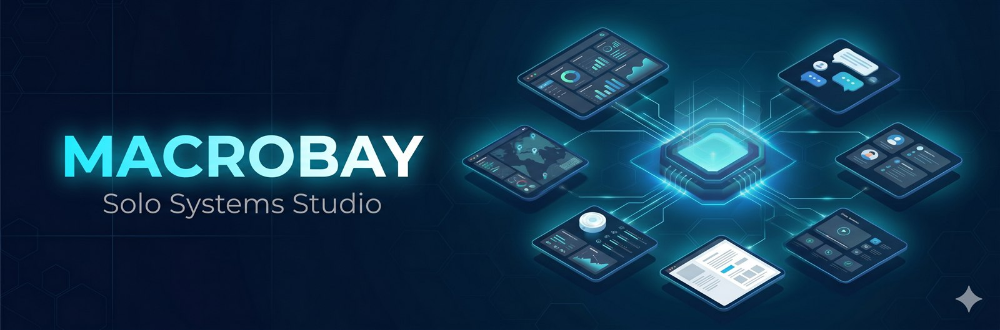
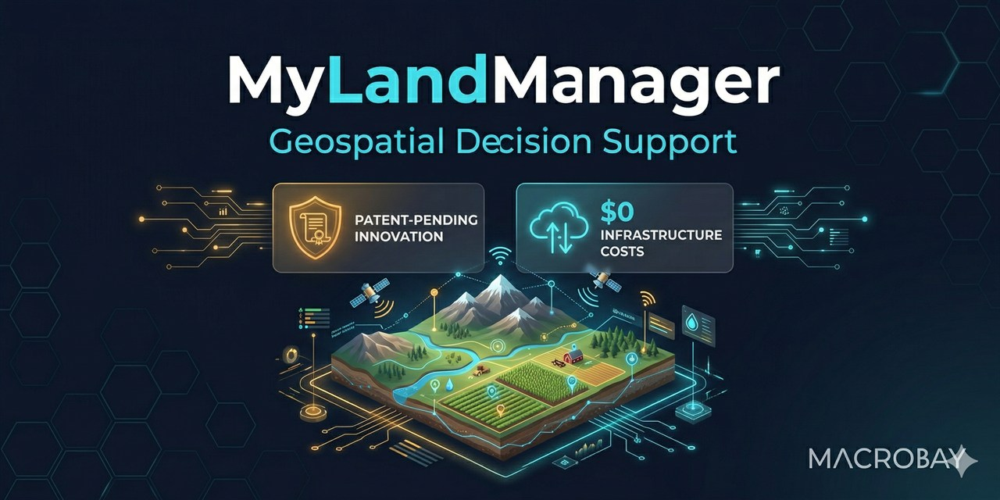
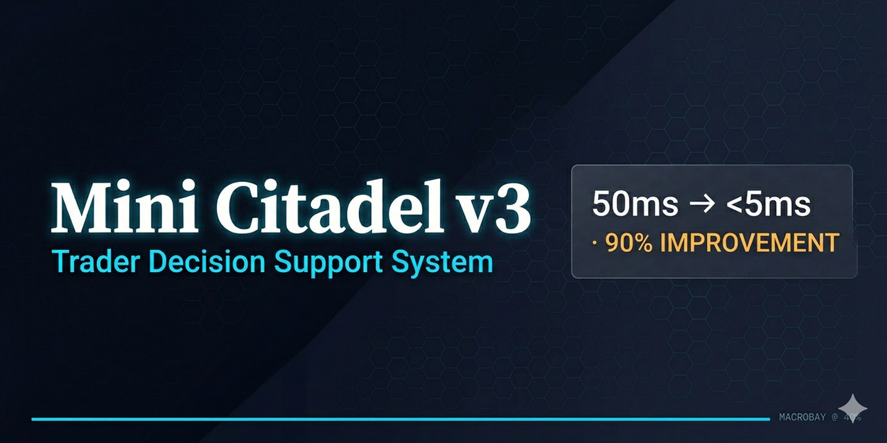
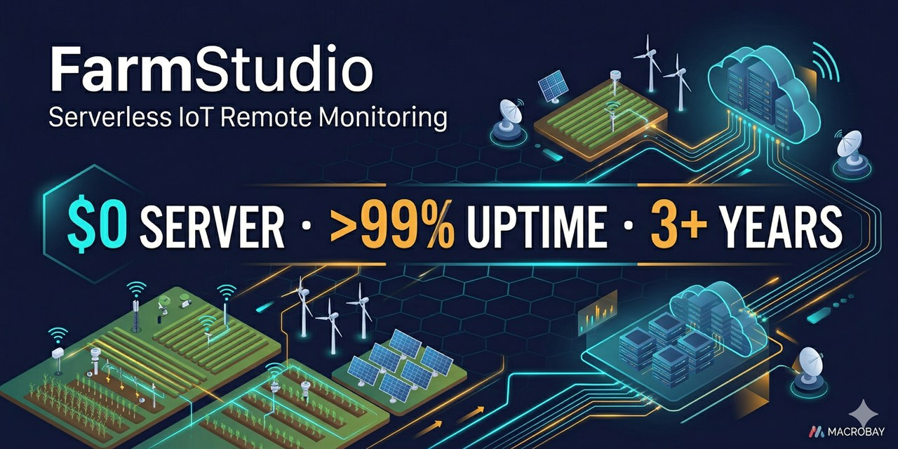

  🌐 <strong>한국어</strong> | <a href="./README.en.md">English</a>

  

# MACROBAY — Systems Architecture for SMBs & Founders

> **"기술 사양을 몰라도 괜찮습니다. 메모·사진·문서·음성 뭐든 주시면 정리해서 방향 제안드리고, 확인 후 빌드합니다."**
>
> *"You don't need a tech spec — just tell me what you want to achieve. I'll organize it, confirm direction, then build and deliver."*

**1인 사업자 · End-to-End 시스템 설계 및 빌드 · 25년+ 실무**
**MACROBAY · Solo Studio · South Korea · Remote Worldwide**

**MACROBAY** — IT Solutions by JuneBay

---

## 📍 외주 활동 중 / Available For Projects

> 4개 플랫폼에서 동시에 외주 받고 있습니다. 보통 **24시간 안에** 답변드립니다.
> Active on 4 freelance platforms — typical response time **within 24 hours**.

---

## 누구인가 / Who We Are

**MACROBAY는 1인 시스템 아키텍처 스튜디오입니다.**
- 25년 이상 시스템 설계·운영 경험 (금융, AI, IoT, 지리정보, 자동화)
- 코드만 짜는 게 아니라 **"비즈니스 목표 → 작동하는 시스템"** 까지 책임
- $0 인프라 / 3년+ 무중단 운영 / 90% 성능 개선 등 실제 운영 결과 보유
- **"이론적 완벽함보다 현실 운영 가능성"** — 비용·운영 지속성 우선 설계

**MACROBAY is a 1-person systems architecture studio**, founded by a senior architect with 25+ years across finance, AI, IoT, geospatial, and automation. We focus on **operational sustainability over theoretical perfection** — building systems that survive in production at sustainable cost.

🌐 **Portfolio site**: [macrobay.kr](https://macrobay.kr)

---

## 어떤 작업을 받습니까 / What We Build

| # | 카테고리 | 대표 결과물 | 핵심 기술 |
|---|---|---|---|
| 1 | **AI 자동화 파이프라인** | WhatIF Factory: $1,350 → $16/영상, 24x 생산성 | GPT-4o · Gemini · Runway · Veo · ElevenLabs · n8n |
| 2 | **금융 시스템 / 트레이딩 인프라** | Mini Citadel: 50ms → <5ms, 90% 성능 개선 | Python · asyncio · WebSocket · O(1) hashmap · PySide6 |
| 3 | **지리정보 / 결정 지원** | MyLandManager: $0 인프라, 100MB+ 처리 | Leaflet · Turf.js · VWorld API · Vercel |
| 4 | **IoT 원격 모니터링** | FarmStudio: $0 서버, >99% 전송률, 3년+ 운영 | ESP32 · SMTP/IMAP · OTA 펌웨어 · 자가복구 데이터 |
| 5 | **데이터 수집 / 크롤링 자동화** | 6계정 이메일 통합, 위시켓·Upwork 스크래핑 | Playwright · BeautifulSoup · imaplib · MSAL OAuth2 |
| 6 | **업무 자동화 / 어드민 / CRM** | 알림 봇, 일일 리포트, AI 분류 파이프라인 | Python · n8n · Telegram Bot API · Flask |
| 7 | **LLM 파이프라인 · AI 에이전트** | 문서 자동 구조화 (95%+ 정확도), API 비용 40~70% 절감, 업무 자동화 에이전트 | OpenAI GPT-4o · Claude · Gemini · FastAPI · PostgreSQL · Redis · BullMQ |

→ 각 카테고리에서 **작은 모듈 (1주 이내)** 부터 **풀스택 시스템 (1~3개월)** 까지 받습니다.

---

## 진행 방식 / How We Work

1. **무엇을 원하시는지 어떤 형식이든 보내주세요**
   메모, 사진, 문서, 스케치, 음성 메모 — 형식 무관
2. **24시간 내에 정리해서 방향 제안드립니다**
   기술 스택·일정·예상 비용·산출물 명확히
3. **방향 확정 후 빌드 시작**
   매일 또는 주 1회 진행 공유 (계약 시 협의)
4. **운영 매뉴얼 + 인계물 함께 전달**
   단순 코드 납품이 아닌, **운영 가능한 시스템** 으로 인계

---

## 대표 프로젝트 4개 / Featured Projects

각 프로젝트의 케이스 스터디는 [`projects/`](./projects/) 폴더에 있습니다.

### 🎬 [WhatIF Factory / Content Factory](./projects/content-factory.md)

**AI 콘텐츠 자동화 파이프라인 · 멀티 LLM 오케스트레이션**

- 영상 1편 제작비 **$1,350 → $16** (98% 절감)
- 일일 생산성 **1편 → 24편** (24x)
- **20개 언어** 자동 로컬라이제이션
- 5+ 인 팀 → **1인 감독 시스템**
- GPT-4o, Gemini, Runway ML, Google Veo, ElevenLabs 통합
- **2개 YouTube 채널** 운영 중

→ [케이스 스터디 보기 →](./projects/content-factory.md)

---

### 🗺️ [MyLandManager](./projects/land-manager.md) — v6.0

**서버리스 지리정보 결정 지원 시스템**

- 인프라 비용 **$0** (Vercel + 정부 OpenAPI, 순수 클라이언트 사이드)
- **100MB+ 지적도 데이터** 브라우저 청크 로딩
- 분쟁 위험 사전 시뮬레이션
- 수기 작업 시간 **80% 단축**
- 정부 포털(토지이음, 인터넷등기소) 통합

→ [케이스 스터디 보기 →](./projects/land-manager.md) · [라이브 서비스](https://landmanager.co.kr) · [데모](https://my-land-manager.vercel.app)

---

### 💹 [Mini Citadel](./projects/mini-citadel.md) — v3

**트레이더 의사결정 지원 시스템 (TDSS) · 5계층 아키텍처 · 25년+ 금융 실무 기반**

- 데이터 조회 **50ms → <5ms** (90% 성능 개선, O(1) 해시맵)
- UI 반응 **500ms → 100ms** (80% 개선, 직접 메모리 참조)
- ZMQ 기반 다중 머신 신호 오케스트레이션 게이트웨이
- 실시간 API 상태 모니터링
- 자동 데이터 아카이빙 (백테스팅용)

→ [케이스 스터디 보기 →](./projects/mini-citadel.md)

---

### 🌾 [FarmStudio](./projects/farm-studio.md)

**서버리스 IoT 원격 모니터링 · 100km+ 무인 운영 3년+**

- 서버 비용 **$0** (이메일 기반 데이터 파이프라인)
- 데이터 전송 성공률 **>99%** (불안정 시골망에서)
- ESP32 5개 장치, **100km+ 원격** 관리
- **OTA 펌웨어 업데이트** — 무인 유지보수
- **3년+ 무중단** 연속 운영 중

→ [케이스 스터디 보기 →](./projects/farm-studio.md)

---

### 🧠 LLM 파이프라인 · AI 에이전트 / LLM Pipeline & AI Agents

**AI 문서 자동 구조화 · 비용 최적화 · 업무 자동화 에이전트**
**AI Document Structuring · Cost Optimization · Workflow Automation Agents**

- PDF/Word/Excel에서 지정 필드 자동 추출, **95%+ 정확도** — Structured Outputs으로 환각 구조적 차단
  Automated field extraction from PDF/Word/Excel, **95%+ accuracy** — hallucination structurally blocked via Structured Outputs
- 멀티 스테이지 모델 라우팅으로 API 비용 **40~70% 절감**, 실제 데이터 기반 GPT-4o · Claude · Gemini 벤치마킹
  Multi-stage model routing cuts API costs **40–70%**; real-data benchmarking across GPT-4o / Claude / Gemini
- Plan → Act → Observe 루프 에이전트 — DB 조회·API 호출·슬랙 전송 등 실제 시스템 액션 수행
  Plan → Act → Observe loop agent — takes real actions: DB writes, API calls, Slack messages
- 예산 안전장치 + 하드 상한 + 비동기 작업 큐(BullMQ) · 4종 에러 분류 · 파괴적 액션 휴먼 승인 구조
  Budget guard + hard cap + async job queue (BullMQ) · 4-category error classification · human-in-the-loop for destructive actions

---

## 기술 스택 / Tech Stack

**Languages**
Python · JavaScript · C++ · C# · SQL · C · Arduino

**Backend / Frameworks**
Flask · FastAPI · Express · Node.js · asyncio · ZeroMQ · WebSocket · BullMQ · Redis · PostgreSQL · SQLite

**Frontend**
React · PySide6 (Qt) · Streamlit · Leaflet.js · Vanilla JS

**AI / LLM**
GPT-4o · GPT-4o-mini · Claude · Gemini · Runway ML · Google Veo · ElevenLabs · Whisper · Structured Outputs

**Cloud / DevOps**
Vercel · Docker · AWS · GCP · Azure · GitHub Actions · Railway

**Data / Automation**
Playwright · Puppeteer · Selenium · BeautifulSoup · pandas · openpyxl · yt-dlp · imaplib · MSAL OAuth2 · n8n · Telegram Bot

**IoT / Hardware**
ESP32 · Raspberry Pi · DHT22 · RS485/Modbus RTU · OTA Updates · SMTP/IMAP Pipelines

**Domains**
Financial Systems · Geospatial Decision Support · IoT Remote Monitoring · AI Content Pipelines · LLM Pipeline Engineering · AI Workflow Agents · Document AI · LegalTech · Korean STT/Audio Annotation · Data Collection · Workflow Automation

---

## 운영 철학 / Philosophy

> **"이론적 완벽함보다 현실 운영 가능성. 빠른 반복보다 안정 배포. 기능 인플레보다 비용 인지 설계."**
>
> *"Practical innovation over theoretical perfection. Stable deployment over rapid iteration. Cost-aware architecture over feature bloat."*

이 철학으로 만들어진 결과:
- **98% 비용 절감** — 전략적 자동화
- **$0 인프라** — 서버리스·공공 API 활용
- **90% 성능 개선** — 데이터 구조 최적화
- **24x 생산성** — End-to-end 자동화
- **3년+ 무중단** — 자가복구 + 원격 관리

---

## 연락 / Contact

**외주 문의는 위 4개 플랫폼 중 편한 곳으로 보내주세요.**
For project inquiries, please use one of the 4 platforms above.

- 🌐 [macrobay.kr](https://macrobay.kr) — Portfolio site
- 💼 [LinkedIn — linkedin.com/in/junebay](https://linkedin.com/in/junebay)
- 🏢 [Upwork](https://www.upwork.com/freelancers/~01b49808a51af3b53c) · [Fiverr](https://www.fiverr.com/sellers/junebay) · [크몽](https://kmong.com/@JuneBay) · [위시켓](https://www.wishket.com/partners/p/somster/)

응답: 보통 **24시간 이내** · Response: typically **within 24 hours**

---

**MACROBAY** · *Solo Systems Studio*
*"Give us your goal — we'll deliver a working system."*

**비슷한 작업 의뢰 가능합니다 — Project commissions and technical partnerships welcome.**

