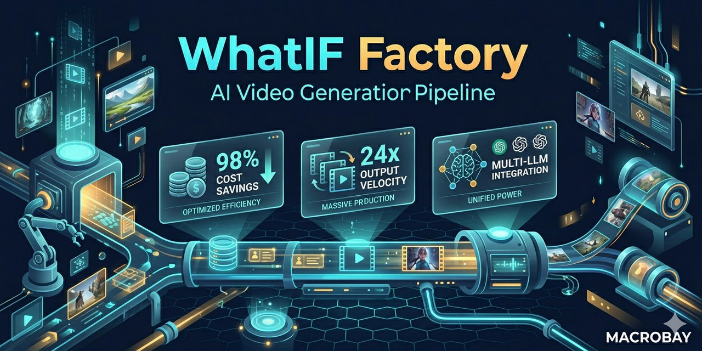

# Content Factory — AI Content Automation Platform

<div align="center">
  
</div>

*[← MACROBAY 메인으로 / Back to portfolio](../README.md)*

**98% Cost Reduction · 24x Productivity · 20 Languages · Available for Similar Projects**

> 비슷한 작업 의뢰 가능합니다. 외주 문의는 [Upwork](https://www.upwork.com/freelancers/~01b49808a51af3b53c) · [Fiverr](https://www.fiverr.com/sellers/junebay) · [크몽](https://kmong.com/@JuneBay) · [위시켓](https://www.wishket.com/partners/p/somster/) 으로.

> Content Factory는 두 라인을 함께 운영합니다 — **WhatIF Factory** (영상) + **Reel Forge** (이미지·웹툰).
> 두 라인 모두 멀티 LLM + 프롬프트 템플릿 + 휴먼-인-루프 검수 패턴을 공유합니다.

[](https://github.com/JuneBay/WhatIF-Factory-Showcase)

---

## 🎯 Project Overview

**WhatIF Factory** is a production-grade AI content automation pipeline that transforms a single topic into fully produced, localized content across 20 languages. Designed with **cost-aware architecture** and **human-in-the-loop** principles, it achieves **98% cost reduction** (from $1,350 to under $16 per video) while replacing **5+ person manual teams** with a **1-person supervised autonomous system**.

The platform is **industry-agnostic**, supporting diverse use cases from social media content (Shorts/Reels) to product demonstrations (cosmetics, industrial parts), quick manuals, and consumer goods marketing—all through a single pipeline architecture.

### Key Metrics
- **98% cost reduction**: $1,350 → under $16 per video (optimized mode)
- **24x productivity increase**: 1 video/day → 24 videos/day
- **20-language** multilingual automation (1,800+ manual hours saved per project)
- **5+ person teams → 1-person** supervised autonomous system
- **Platform versatility**: Single pipeline for Shorts, Product Demos, Manuals, Marketing
- **30-minute** production cycle (Shorts format)

---

## 🚀 Key Achievements

### Business Impact
- **Drastic Cost Reduction**: Lowered production costs from **$1,350 to under $16 per video** through AI automation and intelligent resource management
- **Organizational Efficiency**: Replaced 5+ person manual production teams with a 1-person supervised autonomous system, achieving **98%+ labor cost reduction**
- **Massive Productivity Gain**: Increased output from 1 video/day to **24 videos/day** (24x improvement) while maintaining production quality

### Platform Versatility
- **Universal Content Pipeline**: Single architecture supports diverse formats and industries without reconfiguration:
  - **Social Media**: YouTube Shorts, Instagram Reels, TikTok videos
  - **Product Demonstrations**: Cosmetics tutorials, industrial parts showcases
  - **Quick Manuals**: How-to guides, product instructions
  - **Consumer Goods Marketing**: Brand storytelling, promotional content
- **Industry-Agnostic Design**: Serves solo creators, SMBs, and multi-brand global enterprises

### Global Scale
- **20+ Language Localization**: Automated multilingual content generation eliminating **1,800+ manual hours** per project cycle
- **99.94% Localization Cost Reduction**: AI-driven translation and voice synthesis replacing human translators

---

## 🏗️ System Architecture

```
┌─────────────────────────────────────────────────────────────────┐
│                    Human-in-the-Loop (HITL)                      │
│  ┌──────────────────────────────────────────────────────────┐   │
│  │  Topic Input │ Quality Review │ Final Approval │ Deploy  │   │
│  └──────────────────────────────────────────────────────────┘   │
└─────────────────────────────────────────────────────────────────┘
                               │
                ┌──────────────┴──────────────┐
                │                             │
         ┌──────▼──────┐             ┌───────▼──────┐
         │  Content    │             │  Localization│
         │  Generation │             │   Pipeline   │
         │  (GPT-4o)   │             │  (20+ langs) │
         └─────────────┘             └──────────────┘
                │                             │
                └──────────────┬──────────────┘
                               │
                ┌──────────────▼──────────────┐
                │   Video Production Pipeline  │
                │  ┌────────────────────────┐ │
                │  │ Runway ML / Veo (AI)   │ │
                │  │ FFmpeg (Processing)    │ │
                │  │ SRT Timing Engine      │ │
                │  └────────────────────────┘ │
                └──────────────┬──────────────┘
                               │
                ┌──────────────▼──────────────┐
                │  Automated Distribution     │
                │  (YouTube, Social Platforms)│
                └─────────────────────────────┘
```

**Key Architecture Components:**
- **Human-in-the-Loop**: Strategic oversight at critical decision points
- **Cost-Aware Execution**: Intelligent error classification prevents wasteful API retries
- **Stateful Pipeline**: Save/load/resume at any production stage
- **SRT-Driven Timing**: Automated synchronization of narration, subtitles, and scenes
- **Multi-Platform Distribution**: Automated publishing across channels

---

## 🎨 Core Design Principles

### 1. Human-in-the-Loop (HITL) Architecture
- **Strategic Oversight**: Human approval at critical decision points (topic selection, quality review, final approval)
- **Autonomous Execution**: AI handles repetitive tasks (script generation, video production, localization)
- **Quality Assurance**: Human verification ensures brand consistency and content quality
- **Result**: **1-person supervision** replaces 5+ person teams while maintaining quality

### 2. Cost-Aware Execution
- **Intelligent Error Classification**: 11 error types categorized to prevent wasteful API retries
- **Budget Protection**: Cost-aware logic stops expensive operations on unrecoverable errors
- **Resource Optimization**: Selective use of premium AI models (Runway ML, Veo) only when necessary
- **Result**: **98% cost reduction** ($1,350 → $16 per video)

### 3. SRT-Driven Timing Architecture
- **Automated Synchronization**: SRT subtitle files drive narration, scene transitions, and visual timing
- **Zero Manual Editing**: 100% automated timing eliminates manual video editing labor
- **Precision Timing**: Frame-accurate synchronization of audio, video, and text
- **Result**: **30-minute production cycle** for Shorts format

### 4. Operational Sustainability
- **Stateful Pipeline**: Save/load/resume system enables editing at any stage without full restart
- **Exponential Backoff**: @retry_on_failure decorator handles API instability gracefully
- **Long-Running Stability**: Designed for multi-hour production runs without failure
- **Result**: **Zero pipeline failures** in production use

---

## 💻 Technical Implementation Highlights

### Pipeline Control & Exception Handling
The system implements robust error handling and retry logic to ensure production stability. See [`Pipeline_Control_Snippet.py`](./Pipeline_Control_Snippet.py) for detailed implementation.

**Exponential Backoff Retry Logic:**
```python
@retry_on_failure(max_retries=3, backoff_factor=2)
async def generate_video_scene(prompt, api_client):
    try:
        result = await api_client.generate(prompt)
        return result
    except APIError as e:
        if e.error_type in UNRECOVERABLE_ERRORS:
            raise  # Don't retry on unrecoverable errors
        else:
            # Exponential backoff: 2s, 4s, 8s
            await asyncio.sleep(backoff_factor ** retry_count)
            raise  # Trigger retry
```

**Cost-Aware Error Classification:**
```python
UNRECOVERABLE_ERRORS = [
    "INVALID_PROMPT",      # Don't retry, fix prompt instead
    "CONTENT_POLICY",      # Don't retry, violates policy
    "INSUFFICIENT_CREDITS" # Don't retry, add credits first
]

RECOVERABLE_ERRORS = [
    "RATE_LIMIT",          # Retry with backoff
    "TIMEOUT",             # Retry immediately
    "SERVER_ERROR"         # Retry with backoff
]
```

### Cost Optimization Strategy
| Component | Before (Manual) | After (AI) | Cost Reduction |
|-----------|-----------------|------------|----------------|
| **Script Writing** | $300 (freelancer) | $0.50 (GPT-4o) | **99.8%** |
| **Voice Narration** | $500 (voice actor) | $2.00 (ElevenLabs) | **99.6%** |
| **Video Production** | $400 (editor) | $10.00 (Runway ML) | **97.5%** |
| **Localization (20 langs)** | $150/lang ($3,000) | $3.00 (AI) | **99.9%** |
| **Total** | **$1,350** | **$16** | **98.8%** |

---

## 🔧 Solved Technical Challenges

### 1. Runway ML Credit System Separation
**Challenge**: Runway ML's credit system required separate account management  
**Solution**: Implemented multi-account credit pooling with automatic failover  
**Result**: Uninterrupted production even when individual accounts hit limits

### 2. Veo Access Discovery
**Challenge**: Google Veo API access was not publicly documented  
**Solution**: Discovered access through Google AI Studio experimental features  
**Result**: Early access to cutting-edge video generation capabilities

### 3. YouTube Multilingual Localization Conflict
**Challenge**: YouTube's auto-translation conflicted with pre-translated content  
**Solution**: Disabled YouTube auto-translation, used AI-generated native content  
**Result**: Higher quality localization with natural language flow

### 4. Resolution Unification
**Challenge**: Different AI models produced varying video resolutions  
**Solution**: FFmpeg post-processing pipeline standardizes all outputs to 1080p  
**Result**: Consistent quality across all content

### 5. SRT Timing Gap Handling
**Challenge**: SRT subtitle gaps caused audio/video desynchronization  
**Solution**: Custom timing engine fills gaps and adjusts scene transitions  
**Result**: Frame-perfect synchronization without manual editing

### 6. Human-in-the-Loop Error Handling
**Challenge**: Balancing automation with quality control  
**Solution**: Strategic HITL checkpoints at topic selection, quality review, and final approval  
**Result**: 1-person supervision maintains quality while preserving 98% cost reduction

---

## 📊 Performance Metrics
| Metric | Before (Manual) | After (AI) | Improvement |
|--------|-----------------|------------|-------------|
| **Production Cost** | $1,350/video | $16/video | **98% reduction** |
| **Production Time** | 8 hours/video | 30 minutes/video | **94% faster** |
| **Daily Output** | 1 video/day | 24 videos/day | **24x increase** |
| **Team Size** | 5+ people | 1 person (supervised) | **80%+ labor reduction** |
| **Localization Cost** | $3,000 (20 langs) | $3 (AI) | **99.9% reduction** |
| **Manual Hours Saved** | 1,800+ hours/project | Automated | **Full automation** |

---

## 🚀 Real-World Usage
**WhatIF Factory** is actively used in production content operations:

- **Status**: Production-ready, actively maintained
- **Deployment**: Cloud-based pipeline (Streamlit + Python)
- **Use Cases**: Solo creators, SMBs, multi-brand enterprises
- **Content Types**: Shorts, Reels, Product Demos, Manuals, Marketing

### Platform Versatility Examples
1. **Social Media Creators**: Automated YouTube Shorts and Instagram Reels production
2. **Cosmetics Brands**: Product demonstration videos with multilingual localization
3. **Industrial Manufacturers**: Technical product showcases and quick manuals
4. **Consumer Goods**: Brand storytelling and promotional content
5. **Global Enterprises**: Multi-brand content across 20+ languages

---

## 🛠️ Technology Stack

### AI Models & APIs
- **GPT-4o** - Script generation, content planning
- **Gemini 1.5 Pro** - Alternative content generation
- **Runway ML** - AI video generation
- **Google Veo** - Advanced video synthesis
- **ElevenLabs** - Voice narration synthesis

### Core Technologies
- **Python** - Pipeline orchestration
- **Streamlit** - User interface and workflow management
- **FFmpeg** - Video processing and resolution unification
- **asyncio** - Asynchronous API handling
- **Playwright** - Browser automation for YouTube upload

### Architecture Patterns
- **Human-in-the-Loop (HITL)** - Strategic oversight at critical points
- **Exponential Backoff** - Resilient API retry logic
- **Stateful Pipeline** - Save/load/resume capabilities
- **Cost-Aware Execution** - Intelligent error classification

---

## 📁 Project Structure
```
WhatIF-Factory/
├── pipeline/
│   ├── content_generator.py      # GPT-4o script generation
│   ├── video_producer.py         # Runway ML / Veo integration
│   ├── localization_engine.py    # 20+ language automation
│   └── Pipeline_Control_Snippet.py # Retry logic implementation
├── timing/
│   ├── srt_engine.py             # SRT-driven synchronization
│   └── scene_timing.py           # Automated scene transitions
├── distribution/
│   ├── youtube_uploader.py       # Automated YouTube publishing
│   └── social_distributor.py     # Multi-platform distribution
├── ui/
│   └── streamlit_app.py          # User interface
└── README.md                     # This file
```

---

## 🎓 Architectural Insights

### Why This Architecture?
1. **Cost Efficiency**: 98% cost reduction enables sustainable scaling
2. **Quality Maintenance**: HITL ensures brand consistency despite automation
3. **Operational Resilience**: Stateful pipeline and retry logic prevent failures
4. **Platform Versatility**: Single architecture serves diverse industries
5. **Global Reach**: Automated localization eliminates language barriers

### Key Architectural Decisions
- **HITL Over Full Automation**: Strategic human oversight maintains quality
- **Cost-Aware Over Blind Retry**: Intelligent error handling protects budgets
- **Stateful Over Stateless**: Save/resume enables iterative refinement
- **SRT-Driven Over Manual**: Automated timing eliminates editing labor
- **Multi-Model Over Single**: Flexibility to use best AI model for each task

---

## 📈 Business Impact
- **Democratization**: Solo creators access enterprise-grade production capabilities
- **Scalability**: 24x productivity enables rapid content scaling
- **Global Reach**: 20+ language automation opens international markets
- **Cost Sustainability**: $16/video enables profitable content operations
- **Team Efficiency**: 1-person supervision replaces 5+ person teams

---

## 🔗 Related Resources
- **GitHub**: [JuneBay/WhatIF-Factory-Showcase](https://github.com/JuneBay/WhatIF-Factory-Showcase)
- **LinkedIn**: [linkedin.com/in/junebay](https://linkedin.com/in/junebay)

---

## 💼 외주 문의 / Project Inquiries

**비슷한 프로젝트 의뢰 가능합니다 — Available for similar projects.**

### 이런 작업이면 처리해드릴 수 있습니다
- 멀티 LLM 오케스트레이션 (GPT-4o, Claude, Gemini, Veo, Runway, Flux 등)
- 영상 자동 생성 파이프라인 (YouTube Shorts, Reels, TikTok, 광고)
- 이미지·웹툰 자동 생성 라인 (Reel Forge 형식)
- 다국어 자동 로컬라이제이션 (음성·자막·번역)
- SRT 기반 타이밍 / FFmpeg 후처리 자동화
- 휴먼-인-루프 검수 + 비용 인지 에러 처리
- 프롬프트 CRUD / 템플릿 관리 시스템
- 룰 + LLM 하이브리드 분류 / 자동응답 / 챗봇

### 진행 방식
1. 콘텐츠 종류·플랫폼·수량·예산 먼저 확인 (1~2일)
2. 1주 안에 1~5개 샘플 자동 생성
3. 품질 검증 후 본 파이프라인 + 일/주 단위 운영 셋업
4. 운영 매뉴얼 + 비용 모니터링 대시보드 함께 인계

### 문의 채널
[](https://www.upwork.com/freelancers/~01b49808a51af3b53c)
[](https://www.fiverr.com/sellers/junebay)
[](https://kmong.com/@JuneBay)
[](https://www.wishket.com/partners/p/somster/)
