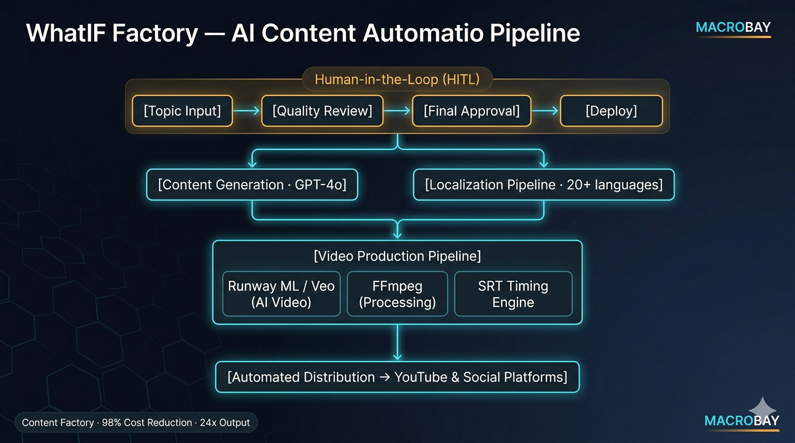

# Content Factory — AI Content Automation Platform

<div align="center">
  
</div>

*[← MACROBAY 메인으로 / Back to portfolio](../README.md)*

**98% 비용 절감 · 생산성 24배 · 20개 언어 · 유사 프로젝트 의뢰 가능**
**98% Cost Reduction · 24x Productivity · 20 Languages · Available for Similar Projects**

> 비슷한 작업 의뢰 가능합니다. 외주 문의는 [Upwork](https://www.upwork.com/freelancers/~01b49808a51af3b53c) · [Fiverr](https://www.fiverr.com/sellers/junebay) · [크몽](https://kmong.com/@JuneBay) · [위시켓](https://www.wishket.com/partners/p/somster/) 으로.
> Available for similar projects — inquiries via [Upwork](https://www.upwork.com/freelancers/~01b49808a51af3b53c) · [Fiverr](https://www.fiverr.com/sellers/junebay) · [Kmong](https://kmong.com/@JuneBay) · [Wishket](https://www.wishket.com/partners/p/somster/).

> Content Factory는 두 라인을 함께 운영합니다 — **WhatIF Factory** (영상) + **Reel Forge** (이미지·웹툰).
> 두 라인 모두 멀티 LLM + 프롬프트 템플릿 + 휴먼-인-루프 검수 패턴을 공유합니다.
> Content Factory runs two lines together — **WhatIF Factory** (video) + **Reel Forge** (image/webtoon).
> Both lines share the same multi-LLM + prompt-template + human-in-the-loop review pattern.

[](https://github.com/JuneBay/WhatIF-Factory-Showcase)

---

## 🎯 프로젝트 개요 / Project Overview

**[KR]** **WhatIF Factory**는 하나의 주제를 20개 언어로 완전히 제작·현지화된 콘텐츠로 변환하는 프로덕션급 AI 콘텐츠 자동화 파이프라인입니다. **비용 인지 아키텍처(cost-aware architecture)**와 **휴먼-인-루프(human-in-the-loop)** 원칙으로 설계되어, **98% 비용 절감**(영상 1편당 $1,350 → $16 미만)을 달성하면서 **5인 이상의 수동 작업 팀**을 **1인 감독형 자율 시스템**으로 대체합니다.

이 플랫폼은 **산업 비종속(industry-agnostic)** 설계로, 소셜 미디어 콘텐츠(Shorts/Reels)부터 제품 시연(화장품, 산업 부품), 퀵 매뉴얼, 소비재 마케팅까지 — 모두 단일 파이프라인 아키텍처로 다양한 활용 사례를 지원합니다.

**[EN]** **WhatIF Factory** is a production-grade AI content automation pipeline that transforms a single topic into fully produced, localized content across 20 languages. Designed with **cost-aware architecture** and **human-in-the-loop** principles, it achieves **98% cost reduction** (from $1,350 to under $16 per video) while replacing **5+ person manual teams** with a **1-person supervised autonomous system**.

The platform is **industry-agnostic**, supporting diverse use cases from social media content (Shorts/Reels) to product demonstrations (cosmetics, industrial parts), quick manuals, and consumer goods marketing—all through a single pipeline architecture.

### 핵심 지표 / Key Metrics

**[KR]**
- **98% 비용 절감**: 영상 1편당 $1,350 → $16 미만 (최적화 모드)
- **생산성 24배 증가**: 1편/일 → 24편/일
- **20개 언어** 다국어 자동화 (프로젝트당 1,800시간 이상 수작업 절감)
- **5인 이상 팀 → 1인** 감독형 자율 시스템
- **플랫폼 다용도성**: Shorts, 제품 시연, 매뉴얼, 마케팅을 위한 단일 파이프라인
- **30분** 제작 사이클 (Shorts 포맷)

**[EN]**
- **98% cost reduction**: $1,350 → under $16 per video (optimized mode)
- **24x productivity increase**: 1 video/day → 24 videos/day
- **20-language** multilingual automation (1,800+ manual hours saved per project)
- **5+ person teams → 1-person** supervised autonomous system
- **Platform versatility**: Single pipeline for Shorts, Product Demos, Manuals, Marketing
- **30-minute** production cycle (Shorts format)

---

## 🚀 주요 성과 / Key Achievements

### 비즈니스 임팩트 / Business Impact

**[KR]**
- **획기적 비용 절감**: AI 자동화와 지능형 리소스 관리를 통해 제작 비용을 영상 1편당 **$1,350에서 $16 미만**으로 절감
- **조직 효율화**: 5인 이상의 수동 제작 팀을 1인 감독형 자율 시스템으로 대체, **98% 이상 인건비 절감** 달성
- **대규모 생산성 향상**: 제작 품질을 유지하면서 산출량을 1편/일에서 **24편/일**로 (24배 향상) 증대

**[EN]**
- **Drastic Cost Reduction**: Lowered production costs from **$1,350 to under $16 per video** through AI automation and intelligent resource management
- **Organizational Efficiency**: Replaced 5+ person manual production teams with a 1-person supervised autonomous system, achieving **98%+ labor cost reduction**
- **Massive Productivity Gain**: Increased output from 1 video/day to **24 videos/day** (24x improvement) while maintaining production quality

### 플랫폼 다용도성 / Platform Versatility

**[KR]**
- **범용 콘텐츠 파이프라인**: 단일 아키텍처가 재구성 없이 다양한 포맷과 산업을 지원:
  - **소셜 미디어**: YouTube Shorts, Instagram Reels, TikTok 영상
  - **제품 시연**: 화장품 튜토리얼, 산업 부품 쇼케이스
  - **퀵 매뉴얼**: 사용 가이드, 제품 설명
  - **소비재 마케팅**: 브랜드 스토리텔링, 프로모션 콘텐츠
- **산업 비종속 설계**: 1인 창작자, 중소기업, 다브랜드 글로벌 기업까지 대응

**[EN]**
- **Universal Content Pipeline**: Single architecture supports diverse formats and industries without reconfiguration:
  - **Social Media**: YouTube Shorts, Instagram Reels, TikTok videos
  - **Product Demonstrations**: Cosmetics tutorials, industrial parts showcases
  - **Quick Manuals**: How-to guides, product instructions
  - **Consumer Goods Marketing**: Brand storytelling, promotional content
- **Industry-Agnostic Design**: Serves solo creators, SMBs, and multi-brand global enterprises

### 글로벌 스케일 / Global Scale

**[KR]**
- **20개 이상 언어 현지화**: 프로젝트 사이클당 **1,800시간 이상의 수작업**을 제거하는 자동 다국어 콘텐츠 생성
- **99.94% 현지화 비용 절감**: AI 기반 번역과 음성 합성이 인간 번역가를 대체

**[EN]**
- **20+ Language Localization**: Automated multilingual content generation eliminating **1,800+ manual hours** per project cycle
- **99.94% Localization Cost Reduction**: AI-driven translation and voice synthesis replacing human translators

---

## 🏗️ 시스템 아키텍처 / System Architecture

<div align="center">
  
</div>

**핵심 아키텍처 구성요소 / Key Architecture Components:**

**[KR]**
- **휴먼-인-루프**: 핵심 의사결정 지점에서의 전략적 감독
- **비용 인지 실행**: 지능형 에러 분류로 낭비성 API 재시도 방지
- **상태 보존 파이프라인**: 어느 제작 단계에서나 저장/불러오기/재개
- **SRT 기반 타이밍**: 내레이션·자막·장면의 자동 동기화
- **멀티 플랫폼 배포**: 여러 채널에 걸친 자동 게시

**[EN]**
- **Human-in-the-Loop**: Strategic oversight at critical decision points
- **Cost-Aware Execution**: Intelligent error classification prevents wasteful API retries
- **Stateful Pipeline**: Save/load/resume at any production stage
- **SRT-Driven Timing**: Automated synchronization of narration, subtitles, and scenes
- **Multi-Platform Distribution**: Automated publishing across channels

---

## 🎨 핵심 설계 원칙 / Core Design Principles

### 1. 휴먼-인-루프(HITL) 아키텍처 / Human-in-the-Loop (HITL) Architecture

**[KR]**
- **전략적 감독**: 핵심 의사결정 지점(주제 선정, 품질 검토, 최종 승인)에서 사람이 승인
- **자율 실행**: AI가 반복 작업(스크립트 생성, 영상 제작, 현지화)을 처리
- **품질 보증**: 사람의 검증이 브랜드 일관성과 콘텐츠 품질을 보장
- **결과**: 품질을 유지하면서 **1인 감독**이 5인 이상의 팀을 대체

**[EN]**
- **Strategic Oversight**: Human approval at critical decision points (topic selection, quality review, final approval)
- **Autonomous Execution**: AI handles repetitive tasks (script generation, video production, localization)
- **Quality Assurance**: Human verification ensures brand consistency and content quality
- **Result**: **1-person supervision** replaces 5+ person teams while maintaining quality

### 2. 비용 인지 실행 / Cost-Aware Execution

**[KR]**
- **지능형 에러 분류**: 11가지 에러 유형을 분류해 낭비성 API 재시도 방지
- **예산 보호**: 비용 인지 로직이 복구 불가 에러 발생 시 고비용 작업을 중단
- **리소스 최적화**: 프리미엄 AI 모델(Runway ML, Veo)을 필요할 때만 선별적으로 사용
- **결과**: **98% 비용 절감** (영상 1편당 $1,350 → $16)

**[EN]**
- **Intelligent Error Classification**: 11 error types categorized to prevent wasteful API retries
- **Budget Protection**: Cost-aware logic stops expensive operations on unrecoverable errors
- **Resource Optimization**: Selective use of premium AI models (Runway ML, Veo) only when necessary
- **Result**: **98% cost reduction** ($1,350 → $16 per video)

### 3. SRT 기반 타이밍 아키텍처 / SRT-Driven Timing Architecture

**[KR]**
- **자동 동기화**: SRT 자막 파일이 내레이션, 장면 전환, 비주얼 타이밍을 구동
- **수동 편집 제로**: 100% 자동 타이밍으로 수동 영상 편집 노동을 제거
- **정밀 타이밍**: 오디오·영상·텍스트의 프레임 단위 정밀 동기화
- **결과**: Shorts 포맷 기준 **30분 제작 사이클**

**[EN]**
- **Automated Synchronization**: SRT subtitle files drive narration, scene transitions, and visual timing
- **Zero Manual Editing**: 100% automated timing eliminates manual video editing labor
- **Precision Timing**: Frame-accurate synchronization of audio, video, and text
- **Result**: **30-minute production cycle** for Shorts format

### 4. 운영 지속가능성 / Operational Sustainability

**[KR]**
- **상태 보존 파이프라인**: 저장/불러오기/재개 시스템으로 전체 재시작 없이 어느 단계에서나 편집 가능
- **지수 백오프(Exponential Backoff)**: @retry_on_failure 데코레이터가 API 불안정을 유연하게 처리
- **장시간 실행 안정성**: 수 시간에 걸친 제작 실행도 실패 없이 동작하도록 설계
- **결과**: 프로덕션 사용에서 **파이프라인 실패 제로**

**[EN]**
- **Stateful Pipeline**: Save/load/resume system enables editing at any stage without full restart
- **Exponential Backoff**: @retry_on_failure decorator handles API instability gracefully
- **Long-Running Stability**: Designed for multi-hour production runs without failure
- **Result**: **Zero pipeline failures** in production use

---

## 💻 기술 구현 하이라이트 / Technical Implementation Highlights

### 파이프라인 제어 및 예외 처리 / Pipeline Control & Exception Handling

**[KR]** 이 시스템은 제작 안정성을 보장하기 위해 견고한 에러 처리와 재시도 로직을 구현합니다. 상세 구현은 [`Pipeline_Control_Snippet.py`](./Pipeline_Control_Snippet.py)를 참고하세요.

**[EN]** The system implements robust error handling and retry logic to ensure production stability. See [`Pipeline_Control_Snippet.py`](./Pipeline_Control_Snippet.py) for detailed implementation.

**지수 백오프 재시도 로직 / Exponential Backoff Retry Logic:**
```python
@retry_on_failure(max_retries=3, backoff_factor=2)
async def generate_video_scene(prompt, api_client):
    try:
        result = await api_client.generate(prompt)
        return result
    except APIError as e:
        if e.error_type in UNRECOVERABLE_ERRORS:
            raise  # Don't retry on unrecoverable errors
        else:
            # Exponential backoff: 2s, 4s, 8s
            await asyncio.sleep(backoff_factor ** retry_count)
            raise  # Trigger retry
```

**비용 인지 에러 분류 / Cost-Aware Error Classification:**
```python
UNRECOVERABLE_ERRORS = [
    "INVALID_PROMPT",      # Don't retry, fix prompt instead
    "CONTENT_POLICY",      # Don't retry, violates policy
    "INSUFFICIENT_CREDITS" # Don't retry, add credits first
]

RECOVERABLE_ERRORS = [
    "RATE_LIMIT",          # Retry with backoff
    "TIMEOUT",             # Retry immediately
    "SERVER_ERROR"         # Retry with backoff
]
```

### 비용 최적화 전략 / Cost Optimization Strategy
| 구성요소 / Component | 이전(수동) / Before (Manual) | 이후(AI) / After (AI) | 비용 절감 / Cost Reduction |
|-----------|-----------------|------------|----------------|
| **스크립트 작성 / Script Writing** | $300 (프리랜서 / freelancer) | $0.50 (GPT-4o) | **99.8%** |
| **음성 내레이션 / Voice Narration** | $500 (성우 / voice actor) | $2.00 (ElevenLabs) | **99.6%** |
| **영상 제작 / Video Production** | $400 (편집자 / editor) | $10.00 (Runway ML) | **97.5%** |
| **현지화 20개 언어 / Localization (20 langs)** | $150/언어 ($3,000) / $150/lang ($3,000) | $3.00 (AI) | **99.9%** |
| **합계 / Total** | **$1,350** | **$16** | **98.8%** |

---

## 🔧 해결한 기술적 과제 / Solved Technical Challenges

### 1. Runway ML 크레딧 시스템 분리 / Runway ML Credit System Separation

**[KR]**
**과제**: Runway ML의 크레딧 시스템이 별도의 계정 관리를 요구함  
**해결**: 자동 페일오버를 갖춘 멀티 계정 크레딧 풀링 구현  
**결과**: 개별 계정이 한도에 도달해도 중단 없는 제작

**[EN]**
**Challenge**: Runway ML's credit system required separate account management  
**Solution**: Implemented multi-account credit pooling with automatic failover  
**Result**: Uninterrupted production even when individual accounts hit limits

### 2. Veo 액세스 확보 / Veo Access Discovery

**[KR]**
**과제**: Google Veo API 액세스가 공개적으로 문서화되어 있지 않음  
**해결**: Google AI Studio의 실험 기능을 통해 액세스 경로 발견  
**결과**: 최첨단 영상 생성 기능에 대한 조기 액세스

**[EN]**
**Challenge**: Google Veo API access was not publicly documented  
**Solution**: Discovered access through Google AI Studio experimental features  
**Result**: Early access to cutting-edge video generation capabilities

### 3. YouTube 다국어 현지화 충돌 / YouTube Multilingual Localization Conflict

**[KR]**
**과제**: YouTube의 자동 번역이 사전 번역된 콘텐츠와 충돌함  
**해결**: YouTube 자동 번역을 비활성화하고 AI 생성 네이티브 콘텐츠 사용  
**결과**: 자연스러운 언어 흐름으로 더 높은 품질의 현지화

**[EN]**
**Challenge**: YouTube's auto-translation conflicted with pre-translated content  
**Solution**: Disabled YouTube auto-translation, used AI-generated native content  
**Result**: Higher quality localization with natural language flow

### 4. 해상도 통일 / Resolution Unification

**[KR]**
**과제**: 서로 다른 AI 모델이 제각기 다른 영상 해상도를 생성함  
**해결**: FFmpeg 후처리 파이프라인으로 모든 출력을 1080p로 표준화  
**결과**: 모든 콘텐츠에 걸친 일관된 품질

**[EN]**
**Challenge**: Different AI models produced varying video resolutions  
**Solution**: FFmpeg post-processing pipeline standardizes all outputs to 1080p  
**Result**: Consistent quality across all content

### 5. SRT 타이밍 간극 처리 / SRT Timing Gap Handling

**[KR]**
**과제**: SRT 자막 간극이 오디오/영상 비동기화를 유발함  
**해결**: 커스텀 타이밍 엔진이 간극을 메우고 장면 전환을 조정  
**결과**: 수동 편집 없이 프레임 단위 완벽 동기화

**[EN]**
**Challenge**: SRT subtitle gaps caused audio/video desynchronization  
**Solution**: Custom timing engine fills gaps and adjusts scene transitions  
**Result**: Frame-perfect synchronization without manual editing

### 6. 휴먼-인-루프 에러 처리 / Human-in-the-Loop Error Handling

**[KR]**
**과제**: 자동화와 품질 관리 사이의 균형  
**해결**: 주제 선정, 품질 검토, 최종 승인 지점에 전략적 HITL 체크포인트 배치  
**결과**: 1인 감독으로 품질을 유지하면서 98% 비용 절감 보존

**[EN]**
**Challenge**: Balancing automation with quality control  
**Solution**: Strategic HITL checkpoints at topic selection, quality review, and final approval  
**Result**: 1-person supervision maintains quality while preserving 98% cost reduction

---

## 📊 성능 지표 / Performance Metrics
| 지표 / Metric | 이전(수동) / Before (Manual) | 이후(AI) / After (AI) | 개선 / Improvement |
|--------|-----------------|------------|-------------|
| **제작 비용 / Production Cost** | $1,350/편 / $1,350/video | $16/편 / $16/video | **98% 절감 / reduction** |
| **제작 시간 / Production Time** | 8시간/편 / 8 hours/video | 30분/편 / 30 minutes/video | **94% 단축 / faster** |
| **일일 산출량 / Daily Output** | 1편/일 / 1 video/day | 24편/일 / 24 videos/day | **24배 증가 / increase** |
| **팀 규모 / Team Size** | 5인 이상 / 5+ people | 1인(감독) / 1 person (supervised) | **80%+ 인력 절감 / labor reduction** |
| **현지화 비용 / Localization Cost** | $3,000 (20개 언어 / 20 langs) | $3 (AI) | **99.9% 절감 / reduction** |
| **수작업 시간 절감 / Manual Hours Saved** | 1,800시간+/프로젝트 / 1,800+ hours/project | 자동화 / Automated | **완전 자동화 / Full automation** |

---

## 🚀 실사용 / Real-World Usage

**[KR]** **WhatIF Factory**는 실제 콘텐츠 운영 프로덕션에서 활발히 사용되고 있습니다:

- **상태**: 프로덕션 준비 완료, 활발히 유지보수 중
- **배포**: 클라우드 기반 파이프라인 (Streamlit + Python)
- **활용 사례**: 1인 창작자, 중소기업, 다브랜드 기업
- **콘텐츠 유형**: Shorts, Reels, 제품 시연, 매뉴얼, 마케팅

**[EN]** **WhatIF Factory** is actively used in production content operations:

- **Status**: Production-ready, actively maintained
- **Deployment**: Cloud-based pipeline (Streamlit + Python)
- **Use Cases**: Solo creators, SMBs, multi-brand enterprises
- **Content Types**: Shorts, Reels, Product Demos, Manuals, Marketing

### 플랫폼 다용도성 예시 / Platform Versatility Examples

**[KR]**
1. **소셜 미디어 창작자**: YouTube Shorts 및 Instagram Reels 자동 제작
2. **화장품 브랜드**: 다국어 현지화가 적용된 제품 시연 영상
3. **산업 제조사**: 기술 제품 쇼케이스 및 퀵 매뉴얼
4. **소비재**: 브랜드 스토리텔링 및 프로모션 콘텐츠
5. **글로벌 기업**: 20개 이상 언어에 걸친 다브랜드 콘텐츠

**[EN]**
1. **Social Media Creators**: Automated YouTube Shorts and Instagram Reels production
2. **Cosmetics Brands**: Product demonstration videos with multilingual localization
3. **Industrial Manufacturers**: Technical product showcases and quick manuals
4. **Consumer Goods**: Brand storytelling and promotional content
5. **Global Enterprises**: Multi-brand content across 20+ languages

---

## 🛠️ 기술 스택 / Technology Stack

### AI 모델 및 API / AI Models & APIs

**[KR]**
- **GPT-4o** - 스크립트 생성, 콘텐츠 기획
- **Gemini 1.5 Pro** - 대체 콘텐츠 생성
- **Runway ML** - AI 영상 생성
- **Google Veo** - 고급 영상 합성
- **ElevenLabs** - 음성 내레이션 합성

**[EN]**
- **GPT-4o** - Script generation, content planning
- **Gemini 1.5 Pro** - Alternative content generation
- **Runway ML** - AI video generation
- **Google Veo** - Advanced video synthesis
- **ElevenLabs** - Voice narration synthesis

### 핵심 기술 / Core Technologies

**[KR]**
- **Python** - 파이프라인 오케스트레이션
- **Streamlit** - 사용자 인터페이스 및 워크플로 관리
- **FFmpeg** - 영상 처리 및 해상도 통일
- **asyncio** - 비동기 API 처리
- **Playwright** - YouTube 업로드용 브라우저 자동화

**[EN]**
- **Python** - Pipeline orchestration
- **Streamlit** - User interface and workflow management
- **FFmpeg** - Video processing and resolution unification
- **asyncio** - Asynchronous API handling
- **Playwright** - Browser automation for YouTube upload

### 아키텍처 패턴 / Architecture Patterns

**[KR]**
- **휴먼-인-루프(HITL)** - 핵심 지점에서의 전략적 감독
- **지수 백오프** - 회복탄력적 API 재시도 로직
- **상태 보존 파이프라인** - 저장/불러오기/재개 기능
- **비용 인지 실행** - 지능형 에러 분류

**[EN]**
- **Human-in-the-Loop (HITL)** - Strategic oversight at critical points
- **Exponential Backoff** - Resilient API retry logic
- **Stateful Pipeline** - Save/load/resume capabilities
- **Cost-Aware Execution** - Intelligent error classification

---

## 📁 프로젝트 구조 / Project Structure
```
WhatIF-Factory/
├── pipeline/
│   ├── content_generator.py      # GPT-4o script generation
│   ├── video_producer.py         # Runway ML / Veo integration
│   ├── localization_engine.py    # 20+ language automation
│   └── Pipeline_Control_Snippet.py # Retry logic implementation
├── timing/
│   ├── srt_engine.py             # SRT-driven synchronization
│   └── scene_timing.py           # Automated scene transitions
├── distribution/
│   ├── youtube_uploader.py       # Automated YouTube publishing
│   └── social_distributor.py     # Multi-platform distribution
├── ui/
│   └── streamlit_app.py          # User interface
└── README.md                     # This file
```

---

## 🎓 아키텍처 인사이트 / Architectural Insights

### 왜 이 아키텍처인가? / Why This Architecture?

**[KR]**
1. **비용 효율성**: 98% 비용 절감으로 지속가능한 스케일링 가능
2. **품질 유지**: HITL이 자동화에도 불구하고 브랜드 일관성 보장
3. **운영 회복탄력성**: 상태 보존 파이프라인과 재시도 로직이 실패 방지
4. **플랫폼 다용도성**: 단일 아키텍처가 다양한 산업에 대응
5. **글로벌 도달**: 자동 현지화가 언어 장벽 제거

**[EN]**
1. **Cost Efficiency**: 98% cost reduction enables sustainable scaling
2. **Quality Maintenance**: HITL ensures brand consistency despite automation
3. **Operational Resilience**: Stateful pipeline and retry logic prevent failures
4. **Platform Versatility**: Single architecture serves diverse industries
5. **Global Reach**: Automated localization eliminates language barriers

### 핵심 아키텍처 결정 / Key Architectural Decisions

**[KR]**
- **완전 자동화보다 HITL**: 전략적인 사람 감독이 품질 유지
- **무분별 재시도보다 비용 인지**: 지능형 에러 처리가 예산 보호
- **무상태보다 상태 보존**: 저장/재개로 반복적 개선 가능
- **수동보다 SRT 기반**: 자동 타이밍이 편집 노동 제거
- **단일 모델보다 멀티 모델**: 작업별 최적 AI 모델 사용 유연성

**[EN]**
- **HITL Over Full Automation**: Strategic human oversight maintains quality
- **Cost-Aware Over Blind Retry**: Intelligent error handling protects budgets
- **Stateful Over Stateless**: Save/resume enables iterative refinement
- **SRT-Driven Over Manual**: Automated timing eliminates editing labor
- **Multi-Model Over Single**: Flexibility to use best AI model for each task

---

## 📈 비즈니스 임팩트 / Business Impact

**[KR]**
- **민주화**: 1인 창작자가 엔터프라이즈급 제작 역량에 접근
- **확장성**: 24배 생산성으로 빠른 콘텐츠 스케일링 가능
- **글로벌 도달**: 20개 이상 언어 자동화로 국제 시장 개척
- **비용 지속가능성**: 영상 1편당 $16으로 수익성 있는 콘텐츠 운영 가능
- **팀 효율성**: 1인 감독이 5인 이상의 팀을 대체

**[EN]**
- **Democratization**: Solo creators access enterprise-grade production capabilities
- **Scalability**: 24x productivity enables rapid content scaling
- **Global Reach**: 20+ language automation opens international markets
- **Cost Sustainability**: $16/video enables profitable content operations
- **Team Efficiency**: 1-person supervision replaces 5+ person teams

---

## 🔗 관련 리소스 / Related Resources
- **GitHub**: [JuneBay/WhatIF-Factory-Showcase](https://github.com/JuneBay/WhatIF-Factory-Showcase)
- **LinkedIn**: [linkedin.com/in/junebay](https://linkedin.com/in/junebay)

---

## 💼 외주 문의 / Project Inquiries

**비슷한 프로젝트 의뢰 가능합니다 — Available for similar projects.**

### 이런 작업이면 처리해드릴 수 있습니다 / What I can take on

**[KR]**
- 멀티 LLM 오케스트레이션 (GPT-4o, Claude, Gemini, Veo, Runway, Flux 등)
- 영상 자동 생성 파이프라인 (YouTube Shorts, Reels, TikTok, 광고)
- 이미지·웹툰 자동 생성 라인 (Reel Forge 형식)
- 다국어 자동 로컬라이제이션 (음성·자막·번역)
- SRT 기반 타이밍 / FFmpeg 후처리 자동화
- 휴먼-인-루프 검수 + 비용 인지 에러 처리
- 프롬프트 CRUD / 템플릿 관리 시스템
- 룰 + LLM 하이브리드 분류 / 자동응답 / 챗봇

**[EN]**
- Multi-LLM orchestration (GPT-4o, Claude, Gemini, Veo, Runway, Flux, etc.)
- Automated video generation pipelines (YouTube Shorts, Reels, TikTok, ads)
- Automated image/webtoon generation line (Reel Forge format)
- Automated multilingual localization (voice, subtitles, translation)
- SRT-driven timing / FFmpeg post-processing automation
- Human-in-the-loop review + cost-aware error handling
- Prompt CRUD / template management systems
- Rule + LLM hybrid classification / auto-reply / chatbots

### 진행 방식 / How it works

**[KR]**
1. 콘텐츠 종류·플랫폼·수량·예산 먼저 확인 (1~2일)
2. 1주 안에 1~5개 샘플 자동 생성
3. 품질 검증 후 본 파이프라인 + 일/주 단위 운영 셋업
4. 운영 매뉴얼 + 비용 모니터링 대시보드 함께 인계

**[EN]**
1. Confirm content type, platform, volume, and budget first (1–2 days)
2. Auto-generate 1–5 samples within a week
3. Set up the full pipeline + daily/weekly operations after quality validation
4. Handover with operations manual + cost-monitoring dashboard

### 문의 채널 / Contact
[](https://www.upwork.com/freelancers/~01b49808a51af3b53c)
[](https://www.fiverr.com/sellers/junebay)
[](https://kmong.com/@JuneBay)
[](https://www.wishket.com/partners/p/somster/)
