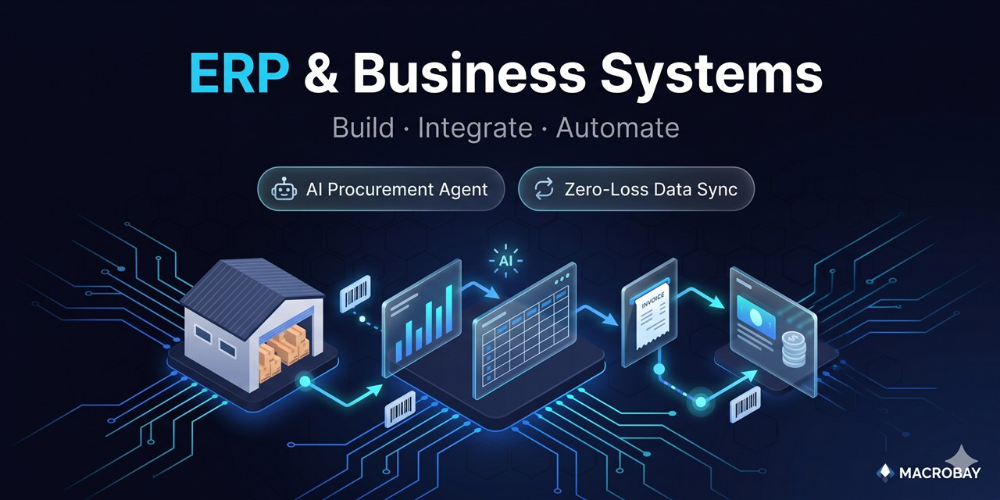

# ERP & Business Systems — Build · Integrate · Automate

  

*[← MACROBAY 메인으로 / Back to portfolio](../README.md)*

**맞춤형 운영 ERP · 구매·정산 AI 에이전트 · 무손실 시스템 연동**
**Custom Operational ERP · Procurement/Settlement AI Agent · Zero-Loss System Integration**

> 비슷한 작업 의뢰 가능합니다 — Available for similar projects.
> 문의: [Upwork](https://www.upwork.com/freelancers/~01b49808a51af3b53c) · [Fiverr](https://www.fiverr.com/sellers/junebay) · [크몽](https://kmong.com/@JuneBay) · [위시켓](https://www.wishket.com/partners/p/somster/)

---

## 🎯 개요 / Overview

**[KR]** 세 가지 축으로 기업의 운영 시스템을 다룹니다 — **직접 구축(Build)**, **AI 자동화(Automate)**, **시스템 연동(Integrate)**. 기성 ERP가 안 맞는 비즈니스를 위해, 입고부터 정산까지 한 흐름으로 묶고, 반복 업무는 AI가 처리하며, 기존 솔루션은 무손실로 연동합니다. 비전문가도 "엑셀처럼 쉽게" 쓰는 것을 1순위로, 이론적 완벽함보다 현실 운영 가능성을 기준으로 설계합니다.

**[EN]** Three pillars for business operations — **Build** a custom ERP, **Automate** the back-office with AI agents, and **Integrate** existing tools without data loss. For businesses an off-the-shelf ERP cannot cover: one flow from inbound to settlement, repetitive work handled by AI, existing systems connected losslessly. Designed for non-technical owners ("as easy as Excel"), prioritizing operational sustainability over theoretical perfection.

---

## 🧱 Pillar 1 — Build: 맞춤형 운영 ERP / Custom Operational ERP

**[KR]** 기성 ERP(이카운트 등)로 안 맞던 다브랜드 수입·유통 비즈니스를 위한 단일 웹 ERP — 입고 → 재고 → 판매 → 정산 전 과정.
- **단일 재고 원장** — SKU × 지점 × 상태(일반/전시/샘플) 통합
- **다브랜드·다채널·다지점** 가격·정산 규칙
- **상품 마스터 자동 채번** — 브랜드 접두 + 모델 + 컬러 규칙, 기존 코드 재사용 (수백 SKU 자동 매칭)
- **바코드 입고 + 1회 실사 리베이스** + 채널별 주문·정산·마진 리포트

**[EN]** A single web ERP for a multi-brand import/distribution business that off-the-shelf ERPs didn't fit — covering inbound → inventory → sales → settlement.
- **Single inventory ledger** — unified across SKU × location × state (general/display/sample)
- **Multi-brand / channel / location** pricing & settlement rules
- **Auto SKU code generation** — brand prefix + model + color rules, reusing existing codes (hundreds of SKUs auto-matched)
- **Barcode inbound + one-time stocktake rebaseline** + per-channel order/settlement/margin reports

---

## 🤖 Pillar 2 — Automate: 구매·정산 AI 에이전트 / Procurement & Settlement AI Agent

**[KR]** ERP 백오피스의 반복 업무(구매 마감·대사·세금계산서 등록)를 대화형 AI 에이전트로 자동화. *(동작하는 PoC — 가상 ERP + MSSQL 연동 설계 기준)*
- **대화형 인텐트 → 툴 라우팅** — OpenAI function calling, API 키 없이도 도는 규칙기반 폴백(Mock 모드)
- **거래처 회신 검증** — 금액·수량 불일치 자동 탐지
- **Staging-Table 무결성 패턴** — AI는 staging 테이블에만 기록 → 사람 승인 → 트랜잭션 배치 커밋 + 롤백
- **월마감 리포트 자동 생성** (Excel · PPT)

**[EN]** Automates repetitive ERP back-office work (monthly close, reconciliation, tax-invoice registration) via a conversational AI agent. *(Working PoC — against a virtual ERP + MSSQL integration design.)*
- **Conversational intent → tool routing** — OpenAI function calling, with a rule-based fallback (Mock mode) that runs without an API key
- **Vendor-reply validation** — auto-detects amount/quantity discrepancies
- **Staging-table integrity pattern** — AI writes only to staging tables → human approval → transactional batch commit + rollback
- **Automated monthly-close reports** (Excel · PPT)

---

## 🔗 Pillar 3 — Integrate: 무손실 시스템 연동 / Zero-Loss Integration

**[KR]** 서로 다른 커머스·ERP 솔루션 사이 데이터 동기화 — 전송 실패 시에도 단 한 건도 잃지 않는 것이 핵심.
- **무손실 실패 원장** — 전송 실패 시 원본 payload + 사유 영구 저장, 버튼 한 번으로 재시도
- **주문번호 UNIQUE → 중복 전송 차단** · **코드 매핑 사전 점검** → 미매핑 건 "보류"
- **실패 건 Excel/CSV 내보내기** + **스케줄러 ON/OFF** (일 1~2회 자동 동기화)
- 예: 커머스 플랫폼(이지어드민 등) → ERP(이카운트 등) 판매·반품 전표 동기화

**[EN]** Data sync between different commerce/ERP solutions — the core requirement being zero record loss even when transmission fails.
- **Zero-loss failure ledger** — on failure, original payload + reason stored permanently, retry with one click
- **Order-number UNIQUE → duplicate-send blocking** · **code-mapping pre-check** → unmapped records held
- **Failed-record Excel/CSV export** + **scheduler ON/OFF** (1–2× daily auto-sync)
- e.g. commerce platform (EasyAdmin, etc.) → ERP (Ecount, etc.) sales/return voucher sync

---

## 📊 At a Glance
| Aspect | Detail |
|--------|--------|
| **Build** | 다브랜드 수입·유통 웹 ERP (입고→재고→판매→정산) / Multi-brand import-distribution web ERP |
| **Automate** | 구매·정산 AI 에이전트 (function calling + 규칙 폴백, staging-table 무결성) / Procurement AI agent |
| **Integrate** | 커머스↔ERP 무손실 동기화 (실패 원장·중복차단·재시도) / Zero-loss commerce↔ERP sync |
| **Stack** | Python · FastAPI · MSSQL/PostgreSQL · SQLite · OpenAI (function calling) · LangGraph · openpyxl · python-pptx · APScheduler |
| **Deploy** | Railway · Render · 로컬 전용 PC 옵션 / local-only PC option · HTTP Basic Auth + rate limit + 보안 헤더 |

---

## 💼 외주 문의 / Project Inquiries

**비슷한 프로젝트 의뢰 가능합니다 — Available for similar projects.**

### 이런 작업이면 처리해드릴 수 있습니다 / What I can take on
- 기성 ERP가 안 맞는 비즈니스용 맞춤형 웹 ERP / Custom web ERP where off-the-shelf doesn't fit
- ERP 백오피스 자동화 (구매 마감·대사·세금계산서·리포트) / ERP back-office automation
- 솔루션 간 데이터 연동/마이그레이션 (무손실 보장) / System integration & migration (lossless)
- 엑셀 업무의 시스템화 · 바코드/재고 실사 / Spreadsheet-to-system, barcode & stocktake

### 진행 방식 / How it works
1. 현재 업무 흐름·데이터·연동 대상(ERP/커머스 API) 확인 (1~2일) / Map current flow, data, integration targets (1–2 days)
2. 1주 안에 핵심 1개 흐름 시범 구현 + 화면 프로토타입 / One key flow + UI prototype within a week
3. 검증 후 전체 확장 + 자동화 + 데이터 마이그레이션 / Expand, automate, migrate after validation
4. 운영 매뉴얼 + 인계 — 단순 코드가 아닌 운영 가능한 시스템으로 / Handover as an operable system, not just code

### 문의 채널 / Contact

