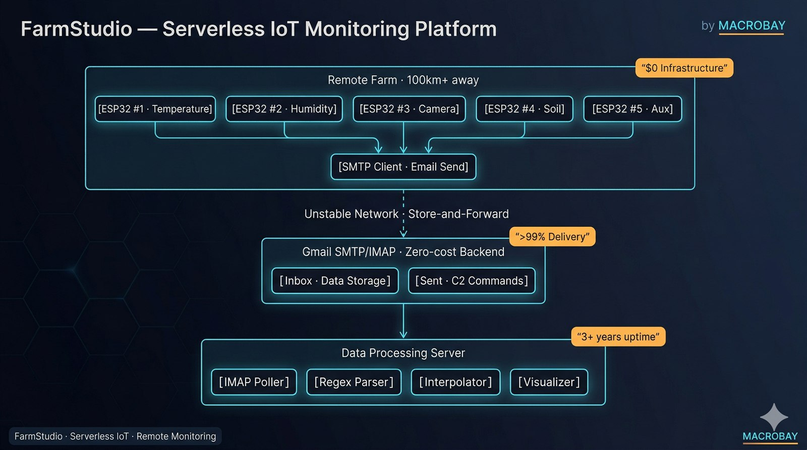

# FarmStudio — Serverless IoT Monitoring Platform

<div align="center">
  
</div>

*[← MACROBAY 메인으로 / Back to portfolio](../README.md)*

**$0 Server · >99% Delivery · 1+ Year Operation · Available for Similar Projects**

> 비슷한 작업 의뢰 가능합니다. 외주 문의는 [Upwork](https://www.upwork.com/freelancers/~01b49808a51af3b53c) · [Fiverr](https://www.fiverr.com/sellers/junebay) · [크몽](https://kmong.com/@JuneBay) · [위시켓](https://www.wishket.com/partners/p/somster/) 으로.

[](https://github.com/JuneBay/FarmStudio-Showcase)

---

## 🎯 프로젝트 개요 / Project Overview

**[KR]** **FarmStudio**는 원격 농장 모니터링을 위한 서버리스 IoT 데이터 수집 시스템으로, 100km 이상 떨어진 ESP32 장치로부터 센서·이미지 데이터를 전용 인프라 없이 수집합니다. 이메일 기반 비동기 데이터 파이프라인을 통해 **운영비 $0**를 달성했으며, 무인 유지보수 상태로 **1년 이상 연속 운영**을 유지하고 있습니다.

**[EN]** **FarmStudio** is a serverless IoT data collection system for remote farm monitoring, collecting sensor and image data from ESP32 devices located 100km+ away without dedicated infrastructure. The system achieves **$0 operational costs** through an email-based asynchronous data pipeline and maintains **1+ year continuous operation** with zero-touch maintenance.

**[KR]** 이메일 프로토콜을 활용한 "No-Database" 아키텍처로 설계되어, 이메일 고유의 store-and-forward 신뢰성과 **자가복구 데이터** 메커니즘(정규식 정규화 + 시계열 보간)을 통해 불안정한 시골 네트워크 환경에서도 **99% 이상의 데이터 전달률**을 달성합니다.

**[EN]** Engineered with a "No-Database" architecture using Email protocols, the platform achieves **>99% data delivery rate** in unstable rural network environments by leveraging email's inherent store-and-forward reliability and **self-healing data** mechanisms (regex normalization + time-series interpolation).

### 핵심 지표 / Key Metrics
- **서버 비용 $0** (이메일 기반 데이터 파이프라인)
- **불안정한 시골 네트워크에서 99% 이상 데이터 전달률**
- **ESP32 장치 5대** 원격 관리 (100km 이상 거리)
- **OTA 펌웨어 업데이트**로 무인 유지보수
- **1년 이상** 무개입 연속 운영
- 정규식 정규화 및 보간을 통한 **자가복구 데이터**

- **$0 server costs** (email-based data pipeline)
- **>99% data delivery rate** in unstable rural networks
- **5 ESP32 devices** managed remotely (100km+ distance)
- **OTA firmware updates** for zero-touch maintenance
- **1+ year** continuous operation without intervention
- **Self-healing data** through regex normalization and interpolation

---

## 🚀 주요 성과 / Key Achievements

### 혁신성 & 비용 효율성 / Innovation & Cost Efficiency
- **No-Database 아키텍처**: 이메일 프로토콜(SMTP/IMAP)을 백엔드로 활용하는 창의적 해법으로, 극한의 자원 제약 속에서 혁신적 문제 해결을 입증
- **운영비 제로**: 상용 IoT 클라우드(AWS IoT, Azure IoT Hub)를 자체 Gmail SMTP/IMAP 파이프라인으로 대체하여 **월 고정비 $0** 달성
- **고가용성**: 이메일의 store-and-forward 신뢰성을 통해 불안정한 시골 네트워크 환경에서 **99% 이상 데이터 전달률** 달성

- **No-Database Architecture**: Engineered a creative solution using Email protocols (SMTP/IMAP) as backend, demonstrating innovative problem-solving under extreme resource constraints
- **Zero Operating Cost**: Replaced commercial IoT cloud services (AWS IoT, Azure IoT Hub) with custom Gmail SMTP/IMAP pipeline, achieving **$0 monthly fixed costs**
- **High Availability**: Achieved **>99% data delivery rate** in unstable rural network environments through email's store-and-forward reliability

### 네트워크 복원력 / Network Resilience
- **이메일 Store-and-Forward**: SMTP 고유의 신뢰성을 활용해 장시간 네트워크 단절 중에도 데이터 전달 보장
- **비동기 아키텍처**: 데이터 수집을 네트워크 가용성과 분리하여, 간헐적 연결 환경에서도 연속 운영 가능
- **자가복구 데이터**: 정규식 기반 정규화와 시계열 보간을 구현하여 센서 오류·데이터 손상에서 복구

- **Email Store-and-Forward**: Leveraged SMTP's inherent reliability to ensure data delivery even during extended network outages
- **Asynchronous Architecture**: Decoupled data collection from network availability, enabling continuous operation in intermittent connectivity
- **Self-Healing Data**: Implemented regex-based normalization and time-series interpolation to recover from sensor errors and data corruption

### 운영 우수성 / Operational Excellence
- **장기 안정성**: 수동 개입이나 시스템 장애 없이 1년 이상 연속 운영
- **원격 관리**: OTA(Over-The-Air) 펌웨어 업데이트로 100km 이상 떨어진 장치의 무인 유지보수 실현
- **다중 포맷 통합**: 단일 데이터 파이프라인으로 서로 다른 데이터 포맷의 ESP32 센서를 통합 처리

- **Long-Term Stability**: 1+ year continuous operation without manual intervention or system failures
- **Remote Management**: OTA (Over-The-Air) firmware updates enable zero-touch maintenance for devices 100km+ away
- **Multi-Format Integration**: Unified data pipeline handles heterogeneous ESP32 sensors with varying data formats

---

## 🏗️ 시스템 아키텍처 / System Architecture

<div align="center">
  
</div>

**핵심 아키텍처 구성 요소 / Key Architecture Components:**
- **ESP32 IoT 장치 / ESP32 IoT Devices**: SMTP 클라이언트 펌웨어를 탑재한 원격 센서 / Remote sensors with SMTP client firmware
- **Gmail SMTP/IMAP**: 상용 IoT 클라우드를 대체하는 무비용 백엔드 / Zero-cost backend replacing commercial IoT clouds
- **정규식 정규화 / Regex Normalization**: 서로 다른 데이터 포맷을 위한 자가복구 파서 / Self-healing parser for heterogeneous data formats
- **시계열 보간 / Time-Series Interpolation**: 누락 데이터 포인트의 갭 채우기 / Gap-filling for missing data points
- **OTA 업데이트 시스템 / OTA Update System**: 원격 펌웨어 관리 / Remote firmware management

---

## 🎨 핵심 설계 원칙 / Core Design Principles

### 1. 운영비 제로 아키텍처 / Zero Operational Cost Architecture
- **백엔드로서의 이메일**: 데이터 업링크는 SMTP, 명령·제어(C2)는 IMAP 사용
- **클라우드 비용 없음**: Gmail 무료 등급이 AWS IoT($0.08/백만 메시지)를 대체
- **데이터베이스 비용 없음**: 이메일 받은편지함이 영구 저장소 역할
- **결과**: **월 운영비 $0**

- **Email as Backend**: SMTP for data uplink, IMAP for Command & Control (C2)
- **No Cloud Fees**: Gmail's free tier replaces AWS IoT ($0.08/million messages)
- **No Database Costs**: Email inbox serves as persistent storage
- **Result**: **$0 monthly operational costs**

### 2. 비동기 데이터 파이프라인 / Asynchronous Data Pipeline
- **Store-and-Forward**: SMTP 고유의 신뢰성으로 데이터 전달 보장
- **네트워크 독립성**: 장치는 단절 시 데이터를 큐에 보관했다가 연결되면 전송
- **배치 처리**: IMAP 폴러가 유연한 일정으로 데이터 수집
- **결과**: 불안정한 네트워크에서 **99% 이상 데이터 전달률**

- **Store-and-Forward**: SMTP's inherent reliability ensures data delivery
- **Network Independence**: Devices queue data during outages, send when connected
- **Batch Processing**: IMAP poller retrieves data on flexible schedules
- **Result**: **>99% data delivery rate** in unstable networks

### 3. 장기 운영 안정성 / Long-Term Operational Stability
- **OTA 펌웨어 업데이트**: 물리적 접근 없이 원격 코드 배포
- **자가복구 데이터**: 정규식 정규화 + 보간으로 오류에서 복구
- **무인 유지보수**: 수동 개입 없이 1년 이상 운영
- **결과**: 원격지에서의 지속 가능한 운영

- **OTA Firmware Updates**: Remote code deployment without physical access
- **Self-Healing Data**: Regex normalization + interpolation recover from errors
- **Zero-Touch Maintenance**: 1+ year operation without manual intervention
- **Result**: Sustainable operation in remote locations

### 4. 다중 포맷 데이터 표준화 / Multi-Format Data Standardization
- **정규식 기반 정규화**: 서로 다른 ESP32 센서를 위한 통합 파서
- **시계열 보간**: 누락·손상 데이터의 갭 채우기
- **포맷 비종속**: JSON, CSV, 평문 센서 출력 처리
- **결과**: 다양한 센서 유형의 매끄러운 통합

- **Regex-Based Normalization**: Unified parser for heterogeneous ESP32 sensors
- **Time-Series Interpolation**: Gap-filling for missing or corrupted data
- **Format Agnostic**: Handles JSON, CSV, plain text sensor outputs
- **Result**: Seamless integration of diverse sensor types

---

## 💻 기술 구현 하이라이트 / Technical Implementation Highlights

### 이메일 기반 데이터 파이프라인 / Email-Based Data Pipeline

**[KR]** 시스템은 SMTP/IMAP 프로토콜을 서버리스 백엔드로 활용하여 클라우드 인프라 비용을 제거합니다. 상세 구현은 [`Email_Pipeline_Snippet.py`](./Email_Pipeline_Snippet.py)를 참조하세요.

**[EN]** The system leverages SMTP/IMAP protocols as a serverless backend, eliminating cloud infrastructure costs. See [`Email_Pipeline_Snippet.py`](./Email_Pipeline_Snippet.py) for detailed implementation.

**SMTP 데이터 업링크 (ESP32) / SMTP Data Uplink (ESP32):**
```cpp
// ESP32 sends sensor data via SMTP
void sendSensorData() {
    String data = "Temp: 25.3C, Humidity: 60%";
    smtp.send("farm@gmail.com", "Sensor Data", data);
    // Email stored in Gmail inbox = persistent storage
}
```

**IMAP 데이터 수신 (서버) / IMAP Data Retrieval (Server):**
```python
# Server polls Gmail inbox for new sensor data
def collect_sensor_data():
    imap = imaplib.IMAP4_SSL('imap.gmail.com')
    imap.login(EMAIL, PASSWORD)
    imap.select('INBOX')
    
    # Fetch unread emails (sensor data)
    status, messages = imap.search(None, 'UNSEEN')
    for msg_id in messages[0].split():
        data = parse_email(msg_id)
        process_sensor_data(data)
```

### 자가복구 데이터 메커니즘 / Self-Healing Data Mechanisms

**정규식 정규화 엔진 / Regex Normalization Engine:**
```python
# Handles heterogeneous sensor data formats
SENSOR_PATTERNS = {
    'temp': r'Temp[:\s]+(\d+\.?\d*)°?C',
    'humidity': r'Hum[:\s]+(\d+\.?\d*)%',
    'soil': r'Soil[:\s]+(\d+\.?\d*)'
}

def normalize_sensor_data(raw_text):
    normalized = {}
    for sensor, pattern in SENSOR_PATTERNS.items():
        match = re.search(pattern, raw_text, re.IGNORECASE)
        if match:
            normalized[sensor] = float(match.group(1))
    return normalized
```

**시계열 보간 / Time-Series Interpolation:**
```python
# Fill gaps in sensor data
def interpolate_missing_data(timeseries):
    df = pd.DataFrame(timeseries)
    df['timestamp'] = pd.to_datetime(df['timestamp'])
    df = df.set_index('timestamp')
    
    # Linear interpolation for missing values
    df = df.resample('1H').interpolate(method='linear')
    return df
```

### 운영비 제로 전략 / Zero Operational Cost Strategy
| Component / 구성 요소 | Commercial IoT / 상용 IoT | FarmStudio | Cost Savings / 비용 절감 |
|-----------|----------------|------------|--------------|
| **Data Ingestion / 데이터 수집** | AWS IoT ($0.08/M msgs) | Gmail SMTP (Free / 무료) | **100%** |
| **Data Storage / 데이터 저장** | DynamoDB ($0.25/GB) | Gmail Inbox (Free / 무료) | **100%** |
| **Command & Control / 명령·제어** | AWS IoT ($0.08/M msgs) | Gmail IMAP (Free / 무료) | **100%** |
| **Total (1 year) / 합계 (1년)** | ~$50-100 | **$0** | **100%** |

---

## 🔧 해결한 기술 과제 / Solved Technical Challenges

### 1. 서버리스 IoT 데이터 수집 / Serverless IoT Data Collection
**과제 / Challenge**: 상용 IoT 클라우드(AWS IoT, Azure)는 취미·소규모 농장에 너무 비쌈 / Commercial IoT clouds (AWS IoT, Azure) too expensive for hobby/small farm  
**해법 / Solution**: Gmail SMTP/IMAP를 무비용 백엔드로 재활용 / Repurposed Gmail SMTP/IMAP as zero-cost backend  
**결과 / Result**: 신뢰성을 유지하면서 운영비 $0 / $0 operational costs while maintaining reliability

### 2. 다중 포맷 데이터 통합 / Multi-Format Data Integration
**과제 / Challenge**: 서로 다른 ESP32 센서가 다양한 데이터 포맷을 생성 / Heterogeneous ESP32 sensors produce varying data formats  
**해법 / Solution**: 패턴 매칭 기반 정규식 정규화 엔진 / Regex-based normalization engine with pattern matching  
**결과 / Result**: 다양한 센서 유형을 위한 통합 데이터 파이프라인 / Unified data pipeline for diverse sensor types

### 3. 이메일 파싱 신뢰성 / Email Parsing Reliability
**과제 / Challenge**: 이메일 본문 파싱이 포맷 변경에 취약 / Email body parsing fragile to format changes  
**해법 / Solution**: 폴백 파싱 전략을 갖춘 견고한 정규식 패턴 / Robust regex patterns with fallback parsing strategies  
**결과 / Result**: 99% 이상의 데이터 추출 성공률 / >99% successful data extraction rate

### 4. OTA 펌웨어 업데이트 / OTA Firmware Updates
**과제 / Challenge**: 100km 이상 떨어진 장치는 물리적 접근 불가 / Physical access impossible for devices 100km+ away  
**해법 / Solution**: IMAP 기반 명령 채널로 OTA 업데이트 트리거 / IMAP-based command channel triggers OTA updates  
**결과 / Result**: 무인 원격 펌웨어 관리 / Zero-touch remote firmware management

### 5. 센서 오류 처리 / Sensor Error Handling
**과제 / Challenge**: 가혹한 환경에서의 센서 고장·데이터 손상 / Sensor failures and data corruption in harsh environments  
**해법 / Solution**: 정규식 정규화 + 시계열 보간을 통한 자가복구 데이터 / Self-healing data through regex normalization + time-series interpolation  
**결과 / Result**: 간헐적 센서 오류에도 연속 운영 / Continuous operation despite occasional sensor errors

---

## 📊 성능 지표 / Performance Metrics
| Metric / 지표 | Target / 목표 | Achieved / 달성 | Notes / 비고 |
|--------|--------|----------|-------|
| **Data Delivery Rate / 데이터 전달률** | >95% | **>99%** | 이메일 store-and-forward 신뢰성 / Email store-and-forward reliability |
| **Operational Cost / 운영비** | <$10/month | **$0** | Gmail 무료 등급 / Gmail free tier |
| **Uptime / 가동률** | >90% | **>99%** | 1년 이상 연속 운영 / 1+ year continuous operation |
| **OTA Success Rate / OTA 성공률** | >90% | **100%** | 모든 원격 업데이트 성공 / All remote updates successful |
| **Data Parsing Success / 데이터 파싱 성공률** | >95% | **>99%** | 정규식 정규화 엔진 / Regex normalization engine |

---

## 🚀 실제 운영 사례 / Real-World Usage

**[KR]** **FarmStudio**는 실제 농장 모니터링 운영 환경에 적극 배포되어 있습니다:

- **상태**: 프로덕션 준비 완료, 1년 이상 연속 운영
- **배포**: 원격 농장 전역에 ESP32 장치 5대 (기지에서 100km 이상)
- **활용 사례**: 온도, 습도, 토양 수분, 카메라 감시
- **네트워크**: 잦은 단절이 있는 불안정한 시골 4G/LTE

**[EN]** **FarmStudio** is actively deployed in production farm monitoring:

- **Status**: Production-ready, 1+ year continuous operation
- **Deployment**: 5 ESP32 devices across remote farm (100km+ from base)
- **Use Cases**: Temperature, humidity, soil moisture, camera surveillance
- **Network**: Unstable rural 4G/LTE with frequent outages

### 운영 특성 / Operational Characteristics
1. **무인 유지보수**: OTA 업데이트로 원격 관리 가능
2. **네트워크 복원력**: 이메일 store-and-forward로 간헐적 연결 처리
3. **비용 지속성**: 운영비 $0로 장기 배포 가능
4. **자가복구**: 정규식 + 보간으로 센서 오류에서 복구
5. **확장성**: 이메일 기반 아키텍처로 수십 대 장치까지 확장

1. **Zero-Touch Maintenance**: OTA updates enable remote management
2. **Network Resilience**: Email store-and-forward handles intermittent connectivity
3. **Cost Sustainability**: $0 operational costs enable long-term deployment
4. **Self-Healing**: Regex + interpolation recover from sensor errors
5. **Scalability**: Email-based architecture scales to dozens of devices

---

## 🛠️ 기술 스택 / Technology Stack

### IoT 하드웨어 / IoT Hardware
- **ESP32** - WiFi 지원 마이크로컨트롤러 / WiFi-enabled microcontroller
- **DHT22** - 온습도 센서 / Temperature/humidity sensor
- **토양 수분 센서 / Soil Moisture Sensor** - 정전용량식 토양 센서 / Capacitive soil sensor
- **ESP32-CAM** - 시각 모니터링용 카메라 모듈 / Camera module for visual monitoring

### 데이터 수집 / Data Collection
- **SMTP** - ESP32로부터의 이메일 기반 데이터 업링크 / Email-based data uplink from ESP32
- **IMAP** - 서버 측 데이터 수신 및 C2 / Server-side data retrieval and C2
- **Gmail** - 무비용 백엔드 인프라 / Zero-cost backend infrastructure

### 데이터 저장 / Data Storage
- **Gmail Inbox** - 영구 센서 데이터 저장소 / Persistent sensor data storage
- **CSV Files** - 장기 분석용 로컬 아카이브 / Local archival for long-term analysis

### 시각화 / Visualization
- **Python** - 데이터 처리 및 분석 / Data processing and analysis
- **Pandas** - 시계열 데이터 조작 / Time-series data manipulation
- **Matplotlib** - 센서 데이터 시각화 / Sensor data visualization

---

## 📁 프로젝트 구조 / Project Structure
```
FarmStudio/
├── esp32/
│   ├── main.ino                  # ESP32 firmware
│   ├── smtp_client.cpp           # SMTP data uplink
│   └── ota_updater.cpp           # OTA firmware update
├── server/
│   ├── imap_poller.py            # Email data retrieval
│   ├── regex_parser.py           # Data normalization
│   ├── interpolator.py           # Time-series gap filling
│   └── Email_Pipeline_Snippet.py # Core email pipeline
├── visualization/
│   └── dashboard.py              # Sensor data visualization
└── README.md                     # This file
```

---

## 🎓 아키텍처 인사이트 / Architectural Insights

### 왜 이 아키텍처인가? / Why This Architecture?
1. **비용 효율성**: 운영비 $0로 지속 가능한 배포 실현
2. **네트워크 복원력**: 이메일 store-and-forward로 불안정한 연결 처리
3. **운영 단순성**: 원격지를 위한 무인 유지보수
4. **검증된 신뢰성**: 수십 년간 검증된 이메일 프로토콜
5. **접근성**: 클라우드 전문 지식 불필요, 표준 이메일 프로토콜 사용

1. **Cost Efficiency**: $0 operational costs enable sustainable deployment
2. **Network Resilience**: Email store-and-forward handles unstable connectivity
3. **Operational Simplicity**: Zero-touch maintenance for remote locations
4. **Proven Reliability**: Email protocols battle-tested over decades
5. **Accessibility**: No cloud expertise required, standard email protocols

### 핵심 아키텍처 결정 / Key Architectural Decisions
- **MQTT 대신 이메일**: SMTP/IMAP이 불안정한 네트워크에서 MQTT보다 신뢰성 높음
- **자체 호스팅 대신 Gmail**: 무료 등급이 서버 비용 제거
- **구조화 대신 정규식**: 유연한 파싱으로 서로 다른 센서 처리
- **엄격함 대신 보간**: 자가복구 데이터가 센서 오류를 허용
- **물리적 접근 대신 OTA**: 100km 이상 거리에서 원격 업데이트 필수

- **Email Over MQTT**: SMTP/IMAP more reliable than MQTT in unstable networks
- **Gmail Over Self-Hosted**: Free tier eliminates server costs
- **Regex Over Structured**: Flexible parsing handles heterogeneous sensors
- **Interpolation Over Strict**: Self-healing data tolerates sensor errors
- **OTA Over Physical**: Remote updates essential for 100km+ distance

---

## 📈 비즈니스 임팩트 / Business Impact
- **비용 접근성**: 운영비 $0로 IoT 모니터링의 대중화
- **시골 배포**: 이메일 복원력으로 원격지 모니터링 가능
- **지속 가능성**: 무인 운영으로 유지보수 부담 감소
- **확장성**: 인프라 투자 없이 확장되는 이메일 기반 아키텍처

- **Cost Accessibility**: $0 operational costs democratize IoT monitoring
- **Rural Deployment**: Email resilience enables monitoring in remote areas
- **Sustainability**: Zero-touch operation reduces maintenance burden
- **Scalability**: Email-based architecture scales without infrastructure investment

---

## 🔗 관련 리소스 / Related Resources
- **GitHub**: [JuneBay/FarmStudio-Showcase](https://github.com/JuneBay/FarmStudio-Showcase)
- **LinkedIn**: [linkedin.com/in/junebay](https://linkedin.com/in/junebay)

---

## 💼 외주 문의 / Project Inquiries

**비슷한 프로젝트 의뢰 가능합니다 — Available for similar projects.**

### 이런 작업이면 처리해드릴 수 있습니다 / What I can take on
- ESP32 / ESP8266 기반 IoT 장치 펌웨어 설계 / ESP32 / ESP8266-based IoT device firmware design
- 원격 센서 데이터 수집 (온도·습도·토양·카메라 등) / Remote sensor data collection (temperature, humidity, soil, camera, etc.)
- 불안정 네트워크 환경 데이터 파이프라인 (시골, 산간, 해외) / Data pipelines for unstable network environments (rural, mountainous, overseas)
- 이메일·MQTT·HTTPS 기반 store-and-forward 아키텍처 / Email/MQTT/HTTPS-based store-and-forward architecture
- OTA(Over-The-Air) 펌웨어 업데이트 시스템 / OTA (Over-The-Air) firmware update systems
- 자가복구 데이터 처리 (정규식 정규화 + 시계열 보간) / Self-healing data processing (regex normalization + time-series interpolation)
- 스마트팜 / 환경 모니터링 / 양식장 / 수처리 / 재고 관리 모니터링 / Smart farms, environmental monitoring, aquaculture, water treatment, inventory monitoring

### 진행 방식 / How it works
1. 측정 대상·환경 조건·통신 가능 채널 먼저 확인 (1~2일) / Identify what to measure, environmental conditions, and available communication channels first (1–2 days)
2. 1주 안에 1~2개 장치 시범 운영 / Pilot 1–2 devices within a week
3. 검증 후 전체 장치 확장 + 모니터링 대시보드 / Expand to all devices + monitoring dashboard after validation
4. 운영 매뉴얼 + OTA 업데이트 절차 함께 인계 / Handover with operation manual + OTA update procedures

### 문의 채널 / Contact
[](https://www.upwork.com/freelancers/~01b49808a51af3b53c)
[](https://www.fiverr.com/sellers/junebay)
[](https://kmong.com/@JuneBay)
[](https://www.wishket.com/partners/p/somster/)
