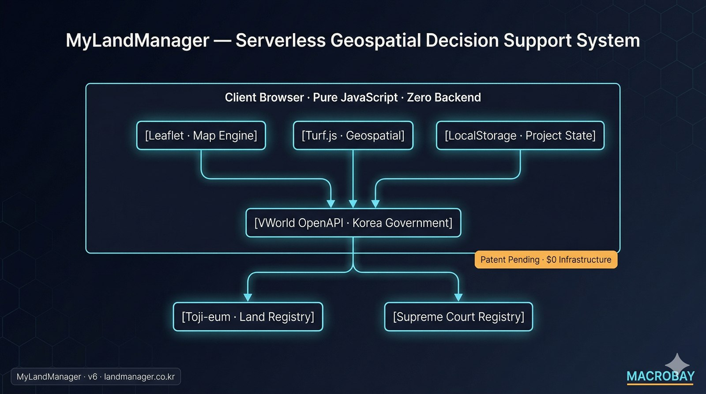

# MyLandManager — Geospatial Decision Support System

<div align="center">
  
</div>

*[← MACROBAY 메인으로 / Back to portfolio](../README.md)*

**$0 인프라 · 프로덕션 운영 · 유사 프로젝트 의뢰 가능**
**$0 Infrastructure · Production · Available for Similar Projects**

> 비슷한 작업 의뢰 가능합니다. 외주 문의는 [Upwork](https://www.upwork.com/freelancers/~01b49808a51af3b53c) · [Fiverr](https://www.fiverr.com/sellers/junebay) · [크몽](https://kmong.com/@JuneBay) · [위시켓](https://www.wishket.com/partners/p/somster/) 으로.
> Available for similar projects — inquire via [Upwork](https://www.upwork.com/freelancers/~01b49808a51af3b53c) · [Fiverr](https://www.fiverr.com/sellers/junebay) · [Kmong](https://kmong.com/@JuneBay) · [Wishket](https://www.wishket.com/partners/p/somster/).

[](https://my-land-manager.vercel.app)
[](https://github.com/JuneBay/My-Land-Manager-Showcase)

---

## 🎯 프로젝트 개요 / Project Overview

**[KR]** **MyLandManager**는 통합 필지 관리를 위한 서버리스 지리정보 의사결정 지원 시스템입니다. 공공 지적 데이터와 주변 인프라 정보를 결합해 사전 계산과 위험 평가를 가능하게 하며, **100MB+ 지리정보 데이터**를 효율적으로 처리하면서 **$0 인프라 비용**을 달성합니다.

**[EN]** **MyLandManager** is a serverless geospatial decision support system for integrated land parcel management. It combines public cadastral data with surrounding infrastructure information to enable pre-calculation and risk assessment—achieving **$0 infrastructure costs** while processing **100MB+ geospatial data** efficiently.

### 핵심 지표 / Key Metrics
- **$0 인프라 비용** (Vercel Free Tier + VWorld OpenAPI) / **$0 infrastructure costs** (Vercel Free Tier + VWorld OpenAPI)
- 반복 작업 **80%+ 시간 단축** / **80%+ time reduction** in repetitive workflows
- **100MB+ 지리정보 데이터** 최적화 / **100MB+ geospatial data** optimization
- **분쟁 위험 관리** 기능 (소송/측량 비용 사전 계산) / **Dispute risk management** features (pre-calculation of litigation/survey costs)
- **정부 포털 연동** (토지이음, 대법원 인터넷등기소) / **Government portal integration** (Toji-eum, Supreme Court Registry)

---

## 🚀 주요 성과 / Key Achievements

### 혁신 및 상용화 / Innovation & Commercialization
- **독자 지리정보 알고리즘**: 맞춤형 지리정보 분석 알고리즘 개발, 현재 상용화 단계 / **Proprietary Geospatial Algorithms**: Developed custom geospatial analysis algorithms, currently in commercialization phase
- **분쟁 위험 관리**: 가상 측량 시뮬레이션으로 소송 및 전문 측량 비용을 사전 계산 — 한국의 심각한 지적 불일치 문제에 대응 / **Dispute Risk Management**: Pre-calculate litigation and professional survey costs through virtual surveying simulation—addressing Korea's severe cadastral mismatch issues
- **원스톱 워크플로우**: 정부 토지 포털(토지이음, 대법원 인터넷등기소)과 매끄럽게 연동되어, 분석에서 문서 발급까지 컨텍스트 전환 없이 이동 / **One-Stop Workflow**: Seamlessly integrated with government land portals (Toji-eum, Supreme Court Registry), enabling users to transition from analysis to document issuance without context switching

### 기술적 우수성 / Technical Excellence
- **제로 인프라 비용**: 순수 클라이언트 사이드 서버리스 아키텍처로 월 $0 운영 비용 / **Zero Infrastructure Cost**: $0 monthly operation cost through pure client-side serverless architecture
- **고성능**: 청크 로딩 전략으로 100MB+ 연속 지적도를 브라우저 내에서 처리 / **High Performance**: 100MB+ contiguous cadastral map processing in-browser using chunk loading strategies
- **상태 보존 워크플로우**: 분석의 모든 단계에서 저장/불러오기/편집 가능, 작업 연속성 보장 / **Stateful Workflow**: Save/load/edit analysis at any stage, ensuring work continuity
- **일괄 리포팅**: 다중 필지 일괄 분석으로 수작업 행정 시간 단축 / **Batch Reporting**: Multi-parcel batch analysis reducing manual administrative time

---

## 🏗️ 시스템 아키텍처 / System Architecture

<div align="center">
  
</div>

**핵심 아키텍처 결정 / Key Architecture Decisions:**
- **No Backend**: 순수 클라이언트 사이드 애플리케이션 (서버 비용 0) / Pure client-side application (zero server costs)
- **Public APIs Only**: VWorld OpenAPI (정부 제공, 무료) / VWorld OpenAPI (government-provided, free)
- **Browser Storage**: LocalStorage + File API로 무제한 프로젝트 용량 / LocalStorage + File API for unlimited project capacity
- **Government Integration**: 토지이음·대법원 포털 직접 링크 / Direct links to Toji-eum and Supreme Court portals

---

## 🎨 핵심 설계 원칙 / Core Design Principles

### 1. 제로 인프라 비용 아키텍처 / Zero Infrastructure Cost Architecture
- **서버리스 설계**: 순수 클라이언트 사이드 애플리케이션 (백엔드 서버 없음) / **Serverless Design**: Pure client-side application (no backend servers)
- **공공 API 연동**: VWorld OpenAPI (정부 제공, 무료) / **Public API Integration**: VWorld OpenAPI (government-provided, free)
- **무료 호스팅**: 정적 호스팅을 위한 Vercel Free Tier / **Free Hosting**: Vercel Free Tier for static hosting
- **결과**: 엔터프라이즈 규모 데이터를 처리하면서 **$0 운영 비용** / **Result**: **$0 operational costs** while handling enterprise-scale data

### 2. 대규모 데이터 최적화 / Large-Scale Data Optimization
- **청크 로딩**: 100MB+ 지리정보 데이터를 1,000 피처 단위 청크로 처리 / **Chunk Loading**: 100MB+ geospatial data processed in 1,000-feature chunks
- **동적 로딩**: 화면에 보이는 지도 영역만 로드해 메모리 사용 최소화 / **Dynamic Loading**: Only visible map areas loaded to minimize memory usage
- **지능형 캐싱**: 자주 접근하는 데이터는 LocalStorage 활용 / **Intelligent Caching**: LocalStorage for frequently accessed data
- **결과**: 전체 데이터셋 로딩 대비 **80% 메모리 절감** / **Result**: **80% memory reduction** compared to full dataset loading

### 3. 상태 보존 프로젝트 관리 / Stateful Project Management
- **LocalStorage 영속화**: 프로젝트 상태 자동 저장 (5-10MB 제한) / **LocalStorage Persistence**: Automatic project state saving (5-10MB limit)
- **File API 내보내기/가져오기**: JSON 파일로 무제한 프로젝트 크기 / **File API Export/Import**: Unlimited project size via JSON files
- **IndexedDB 연동**: 파일 핸들 영속화로 매끄러운 UX / **IndexedDB Integration**: File handle persistence for seamless UX
- **결과**: 프로젝트 재사용으로 **80%+ 워크플로우 시간 단축** / **Result**: **80%+ workflow time reduction** through project reuse

### 4. 공공 데이터 연동 / Public Data Integration
- **VWorld OpenAPI**: 지적도, 토지 공시지가, 주소 검색 / **VWorld OpenAPI**: Cadastral maps, land valuation, address search
- **실시간 데이터**: DB 유지보수 없이 실시간 부동산 정보 / **Real-time Data**: Live property information without database maintenance
- **CORS 처리**: 교차 출처 요청을 위한 JSONP 폴백 / **CORS Handling**: JSONP fallback for cross-origin requests
- **결과**: 인프라 부담 없이 항상 최신 데이터 / **Result**: Always up-to-date data without infrastructure overhead

### 5. 분쟁 위험 관리 / Dispute Risk Management
- **가상 측량**: 비싼 법적 절차에 앞서 전문 경계 측량을 시뮬레이션 / **Virtual Surveying**: Simulate professional boundary surveys before expensive legal proceedings
- **비용 사전 계산**: 필지 복잡도 기반으로 소송 및 전문 측량 비용 추정 / **Cost Pre-calculation**: Estimate litigation and professional survey costs based on parcel complexity
- **위험 평가**: 지적 불일치가 있는 고위험 필지 식별 / **Risk Assessment**: Identify high-risk parcels with cadastral mismatches
- **정부 포털 연동**: 토지이음·대법원 인터넷등기소로 직접 이어지는 문서 발급 워크플로우 / **Government Portal Integration**: Direct workflow to Toji-eum and Supreme Court Registry for document issuance
- **결과**: 조기 위험 식별과 데이터 기반 의사결정 지원으로 **값비싼 분쟁 예방** / **Result**: **Prevent costly disputes** through early risk identification and data-driven decision support

---

## 💻 기술 구현 하이라이트 / Technical Implementation Highlights

### 지리정보 데이터 처리 / Geospatial Data Processing

**[KR]** 본 시스템은 대규모 지리정보 데이터셋을 위한 효율적인 청크 기반 로딩 및 처리를 구현합니다. 상세 구현은 [`Geospatial_Logic_Snippet.js`](./Geospatial_Logic_Snippet.js)를 참고하세요.

**[EN]** The system implements efficient chunk-based loading and processing for large-scale geospatial datasets. See [`Geospatial_Logic_Snippet.js`](./Geospatial_Logic_Snippet.js) for detailed implementation.

**주요 기능 / Key Features:**
- **페이지네이션 전략**: API 요청당 1,000 피처 (지역당 최대 20,000 필지) / **Pagination Strategy**: 1,000 features per API request (up to 20,000 parcels per region)
- **메모리 최적화**: 피처를 한 번에 모두가 아닌 점진적으로 로드 / **Memory Optimization**: Features loaded incrementally, not all at once
- **오류 복구**: WMS 레이어 폴백을 통한 자동 재시도 / **Error Recovery**: Automatic retry with fallback to WMS layers
- **성능**: 캐시된 지역은 1초 미만 응답 / **Performance**: Sub-second response for cached regions

### 제로 인프라 비용 전략 / Zero Infrastructure Cost Strategy
| 구성요소 / Component | 기술 / Technology | 비용 / Cost | 최적화 / Optimization |
|-----------|-----------|------|--------------|
| **호스팅 / Hosting** | Vercel Free Tier | $0.00 | 정적 사이트 호스팅 / Static site hosting |
| **백엔드 / Backend** | 없음(클라이언트 사이드) / None (Client-side) | $0.00 | 순수 JavaScript 애플리케이션 / Pure JavaScript application |
| **데이터베이스 / Database** | LocalStorage + File API | $0.00 | 브라우저 네이티브 스토리지 / Browser-native storage |
| **지도 API / Maps API** | VWorld OpenAPI | $0.00 | 정부 제공 무료 API / Government-provided free API |
| **합계 / Total** | | **$0.00** | 완전한 서버리스 아키텍처 / Complete serverless architecture |

---

## 🔧 해결한 기술적 과제 / Solved Technical Challenges

### 1. 대규모 지리정보 데이터 처리 / Large-Scale Geospatial Data Processing
**과제 / Challenge**: 100MB+ GeoJSON 파일이 브라우저를 멈춤 / 100MB+ GeoJSON files freeze browsers  
**해결 / Solution**: 청크 기반 로딩 (청크당 1,000 피처) + 동적 뷰포트 렌더링 / Chunk-based loading (1,000 features/chunk) + dynamic viewport rendering  
**결과 / Result**: 20,000+ 필지에서도 매끄러운 성능 / Smooth performance even with 20,000+ parcels

### 2. LocalStorage 용량 제한 / LocalStorage Capacity Limitation
**과제 / Challenge**: 5-10MB LocalStorage 제한이 대형 프로젝트에 부족 / 5-10MB LocalStorage limit insufficient for large projects  
**해결 / Solution**: 하이브리드 스토리지 (활성 데이터는 LocalStorage + 아카이브는 File API) / Hybrid storage (LocalStorage for active + File API for archive)  
**결과 / Result**: 빠른 접근을 유지하면서 무제한 프로젝트 용량 / Unlimited project capacity while maintaining fast access

### 3. VWorld API CORS 처리 / VWorld API CORS Handling
**과제 / Challenge**: 직접 API 호출을 차단하는 교차 출처 제한 / Cross-origin restrictions blocking direct API calls  
**해결 / Solution**: JSONP 폴백 + WMS 레이어 대안 / JSONP fallback + WMS layer alternative  
**결과 / Result**: 모든 브라우저에서 100% API 가용성 / 100% API availability across all browsers

### 4. 반응형 지도 인터페이스 / Responsive Map Interface
**과제 / Challenge**: 다중 데이터 레이어와 컨트롤을 가진 복잡한 UI / Complex UI with multiple data layers and controls  
**해결 / Solution**: Leaflet.js + 맞춤형 컨트롤 패널 + 모바일 우선 설계 / Leaflet.js + custom control panels + mobile-first design  
**결과 / Result**: 데스크탑/태블릿/모바일 전반에서 매끄러운 경험 / Seamless experience across desktop/tablet/mobile

### 5. 프로젝트 상태 관리 / Project State Management
**과제 / Challenge**: 상태 영속화가 필요한 복잡한 분석 워크플로우 / Complex analysis workflows requiring state persistence  
**해결 / Solution**: 저장/불러오기/재개 기능을 갖춘 상태 보존 아키텍처 / Stateful architecture with save/load/resume capabilities  
**결과 / Result**: 작업 연속성으로 80%+ 시간 단축 / 80%+ time reduction through work continuity

---

## 📊 성능 지표 / Performance Metrics
| 지표 / Metric | 이전 / Before | 이후 / After | 개선 / Improvement |
|--------|--------|-------|-------------|
| **작업 시간 / Work Time** | 세션당 20-35분 / 20-35 minutes/session | 세션당 1-2분 / 1-2 minutes/session | **80%+ 단축 / reduction** |
| **인프라 비용 / Infrastructure Cost** | 서버 + DB 비용 / Server + DB costs | **$0** (서버리스 / Serverless) | **100% 절감 / reduction** |
| **데이터 처리 / Data Processing** | 수동 입력 / Manual entry | 자동 계산 / Automatic calculation | **완전 자동화 / Full automation** |
| **메모리 사용 / Memory Usage** | 전체 데이터셋 로드 / Full dataset load | 청크 기반 로딩 / Chunk-based loading | **80% 절감 / reduction** |
| **프로젝트 저장 / Project Storage** | LocalStorage로 제한 / Limited by LocalStorage | 무제한(File API) / Unlimited (File API) | **무제한 용량 / Unlimited capacity** |
| **확장성 / Scalability** | 지역별 개별 빌드 / Region-specific builds | 전국 커버리지 / Nationwide coverage | **범용 시스템 / Universal system** |

---

## 🚀 실사용 / Real-World Usage

**[KR]** **MyLandManager**는 프로덕션 환경에 실제 배포·사용되고 있습니다:

**[EN]** **MyLandManager** is actively deployed and used in production:

- **라이브 서비스 / Live Service**: [my-land-manager.vercel.app](https://my-land-manager.vercel.app)
- **배포 / Deployment**: Vercel (Free Tier)
- **상태 / Status**: 프로덕션 준비 완료, 지속 유지보수 중 / Production-ready, actively maintained
- **사용자 / Users**: 공무원, 부동산 전문가, 개발자 / Government officials, real estate professionals, developers

### 활용 사례 / Use Cases
1. **공무원 / Government Officials**: 토지대장 관리, 분쟁 예방, 현장 측량 준비 / Land registry management, dispute prevention, field survey preparation
2. **부동산 중개사 / Real Estate Agents**: 매물 관리, 고객 상담, 시세 확인 / Property management, client consultation, market price checking
3. **개발사 / Developers**: 부지 선정, 위험 평가, 사업 타당성 검토 / Site selection, risk assessment, project feasibility review
4. **농업/임업 / Agriculture/Forestry**: 농지 관리, 작물 계획, 보조금 신청 / Farm management, crop planning, subsidy applications

### 분쟁 예방 워크플로우 / Dispute Prevention Workflow
1. **위험 식별 / Identify Risk**: 대상 필지의 지적 불일치 탐지 / Detect cadastral mismatches in target parcels
2. **가상 측량 / Virtual Survey**: 전문 경계 측량 시뮬레이션 / Simulate professional boundary survey
3. **비용 추정 / Cost Estimation**: 잠재 소송/측량 비용 계산 / Calculate potential litigation/survey expenses
4. **의사결정 지원 / Decision Support**: 데이터 기반 권고 제공 / Provide data-driven recommendations
5. **정부 연동 / Government Integration**: 토지이음 또는 대법원 인터넷등기소로 문서 발급 직접 연결 / Direct link to Toji-eum or Supreme Court Registry for document issuance

---

## 🛠️ 기술 스택 / Technology Stack

### 프론트엔드 / Frontend
- **Vanilla JavaScript** (ES6+) - 프레임워크 오버헤드 0 / Zero framework overhead
- **HTML5/CSS3** - 시맨틱 마크업, 반응형 디자인 / Semantic markup, responsive design

### 지도 라이브러리 / Mapping Libraries
- **Leaflet.js** - 인터랙티브 지도 렌더링 / Interactive map rendering
- **Turf.js** - 지리정보 계산 (면적, 거리, 교차) / Geospatial calculations (area, distance, intersection)

### API 및 서비스 / APIs & Services
- **VWorld OpenAPI** - 지적도, 토지 공시지가 / Cadastral maps, land valuation
- **Kakao Maps API** - 주소 검색, 지오코딩 / Address search, geocoding
- **정부 포털 / Government Portals** - 토지이음, 대법원 인터넷등기소 연동 / Toji-eum, Supreme Court Registry integration

### 데이터 저장 / Data Storage
- **LocalStorage** - 활성 프로젝트 상태 (5-10MB) / Active project state (5-10MB)
- **File API** - 프로젝트 내보내기/가져오기 (무제한) / Project export/import (unlimited)
- **IndexedDB** - 파일 핸들 영속화 / File handle persistence

---

## 📁 프로젝트 구조 / Project Structure
```
My-Land-Manager/
├── index.html              # Main application entry
├── main.js                 # Core application logic
├── map_script.js           # Map initialization & controls
├── Geospatial_Logic_Snippet.js  # Chunk loading implementation
├── styles.css              # Application styling
└── README.md               # This file
```

---

## 🎓 아키텍처 인사이트 / Architectural Insights

### 왜 이 아키텍처인가? / Why This Architecture?
1. **비용 효율 / Cost Efficiency**: $0 인프라 비용으로 지속 가능한 운영 / $0 infrastructure costs enable sustainable operation
2. **확장성 / Scalability**: 클라이언트 사이드 처리는 사용자 하드웨어에 맞춰 확장 / Client-side processing scales with user hardware
3. **신뢰성 / Reliability**: 서버 의존성 없음 = 다운타임 없음 / No server dependencies = no downtime
4. **프라이버시 / Privacy**: 모든 데이터 처리가 브라우저 내 로컬에서 발생 / All data processing happens locally in the browser
5. **접근성 / Accessibility**: 무료 공공 API로 장기 지속성 확보 / Free public APIs ensure long-term viability

### 핵심 아키텍처 결정 / Key Architectural Decisions
- **클라이언트 사이드 전용 / Client-side Only**: 서버 비용과 유지보수 제거 / Eliminates server costs and maintenance
- **청크 로딩 / Chunk Loading**: 가용 RAM보다 큰 데이터셋 처리 가능 / Enables processing of datasets larger than available RAM
- **상태 보존 설계 / Stateful Design**: 프로젝트 영속화로 반복 작업 감소 / Reduces repetitive work through project persistence
- **정부 연동 / Government Integration**: 분석에서 문서 발급까지 원스톱 워크플로우 / One-stop workflow from analysis to document issuance
- **독자 알고리즘 / Proprietary Algorithms**: 맞춤형 분쟁 위험 관리 알고리즘 / Custom dispute risk management algorithms

---

## 📈 비즈니스 임팩트 / Business Impact
- **상용화 / Commercialization**: 독자 기능이 제품 개발을 견인 / Proprietary features driving product development
- **시장 적합성 / Market Fit**: 한국 토지 관리의 핵심 페인 포인트 해결 / Addresses critical pain points in Korean land management
- **확장성 / Scalability**: 사용자 추가당 한계 비용 0 / Zero marginal cost per additional user
- **지속 가능성 / Sustainability**: $0 운영 비용으로 장기 지속성 확보 / $0 operational costs ensure long-term viability

---

## 🔗 관련 리소스 / Related Resources
- **라이브 데모 / Live Demo**: [my-land-manager.vercel.app](https://my-land-manager.vercel.app)
- **GitHub**: [JuneBay/My-Land-Manager-Showcase](https://github.com/JuneBay/My-Land-Manager-Showcase)
- **LinkedIn**: [linkedin.com/in/junebay](https://linkedin.com/in/junebay)

---

## 💼 외주 문의 / Project Inquiries

**비슷한 프로젝트 의뢰 가능합니다 — Available for similar projects.**

### 이런 작업이면 처리해드릴 수 있습니다 / What I can take on
- 정부 OpenAPI 통합 (VWorld, 토지이음, 인터넷등기소, NABZ 등) / Government OpenAPI integration (VWorld, Toji-eum, Registry, NABZ, etc.)
- 대용량 지리정보 데이터 (100MB+) 브라우저 처리 / 청크 로딩 / In-browser processing of large geospatial data (100MB+) / chunk loading
- 서버리스 / $0 인프라 설계 (Vercel + 공공 API 조합) / Serverless / $0 infrastructure design (Vercel + public API combination)
- 부동산·지적·도시계획 결정 지원 시스템 / Real estate, cadastral & urban-planning decision support systems
- LocalStorage + File API 기반 상태 영속화 / 프로젝트 관리 / LocalStorage + File API state persistence / project management
- 분쟁 위험 시뮬레이션 / 비용 사전 계산 모델 / Dispute risk simulation / cost pre-calculation models

### 진행 방식 / How it works
1. 데이터 출처와 사용 시나리오 먼저 확인 (1~2일) / Confirm data sources and usage scenarios first (1–2 days)
2. 1주 안에 최소 작동 프로토타입 / A minimal working prototype within a week
3. 검증 후 본 빌드 + 매주 진행 공유 / Full build after validation + weekly progress sharing
4. 운영 매뉴얼 + 데이터 파이프라인 함께 인계 / Handover with operations manual + data pipeline

### 문의 채널 / Contact
[](https://www.upwork.com/freelancers/~01b49808a51af3b53c)
[](https://www.fiverr.com/sellers/junebay)
[](https://kmong.com/@JuneBay)
[](https://www.wishket.com/partners/p/somster/)
