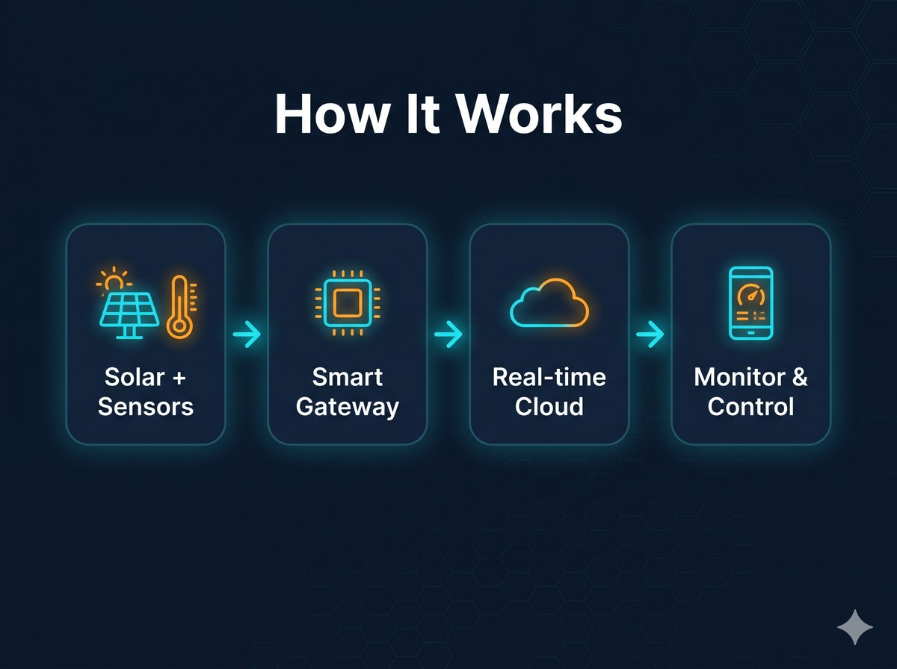

# Solar Smart-Farm — RS485/Modbus Monitoring & Control System

  

*[← MACROBAY 메인으로 / Back to portfolio](../README.md)*

**Raspberry Pi Gateway · 6-Device RS485/Modbus Bus · Solar (MPPT) + DC-DC Power · Real-time Firebase Dashboard · Relay Control · Remote-Managed**

> 비슷한 작업 의뢰 가능합니다. 외주 문의는 [Upwork](https://www.upwork.com/freelancers/~01b49808a51af3b53c) · [Fiverr](https://www.fiverr.com/sellers/junebay) · [크몽](https://kmong.com/@JuneBay) · [위시켓](https://www.wishket.com/partners/p/somster/) 으로.

---

## 🎯 Project Overview

A turnkey **smart-farm monitoring & control system** built around a **Raspberry Pi gateway** that polls a **6-device RS485/Modbus bus**, pushes readings to **Firebase Realtime Database** every 60 seconds, and serves a **responsive real-time web dashboard** with manual + rule-based **relay control**, time-series charts, and CSV export. The site runs off **solar power**, so an **MPPT charge controller** and **DC-DC converter** are monitored alongside the environmental sensors. The entire unit is managed **remotely** — zero on-site visits required after install.

### Key Features
- **6 RS485/Modbus devices on 2 serial ports** — clean addressing, no bus contention
- **Solar power monitoring** — MPPT charge controller (PV voltage / current / status) + DC-DC converter (in/out/current)
- **3-phase bidirectional power meter** (Modbus-RTU)
- **Environmental sensing** — 2× RS485 temperature/humidity + IP68 waterproof lux sensor (0–200,000 lx)
- **3-channel relay control** — manual toggle + automated rules (time / temperature / humidity, 3-condition AND)
- **Real-time dashboard** — PC/mobile responsive, live values, 4 time-series charts, CSV export, system-health panel
- **Remote management** — secure remote access for maintenance, config, and updates without site visits

---

## 🏗️ How It Works

  

Solar-powered field sensors feed a small on-site **gateway**, which reads them on a fixed cycle, applies automatic rules, and pushes everything to a **real-time cloud**. From there a web **dashboard** lets the operator monitor and control the site from anywhere — fully remote, no site visits.

**Stable bus design:** the high-traffic power source sits on its own serial line, isolated from the sensor bus, so the two never contend — keeping polling reliable.

---

## 🔧 Solved Technical Challenges

### 1. Multi-Device RS485/Modbus Integration
**Challenge**: Six heterogeneous Modbus devices (MPPT, DC-DC, 3-phase meter, temp/humidity ×2, lux) with different register maps, baud rates, and addresses on a shared bus.
**Solution**: Two-port topology + per-device address assignment + a unified Modbus reader that maps each device's registers into a single normalized snapshot.
**Result**: Stable 60-second polling of all devices with no bus collisions.

### 2. Solar / Off-Grid Power Monitoring
**Challenge**: The unit runs on solar, so power availability and battery/charge state must be visible alongside the crop sensors.
**Solution**: Read the MPPT charge controller (PV voltage, current, status) and DC-DC converter (in/out/current) over Modbus and surface them on the dashboard.
**Result**: Operators can see generation and load at a glance — early warning for power issues in an off-grid setup.

### 3. 3-Phase Bidirectional Power Metering
**Challenge**: 3-phase Modbus-RTU power meters use a different register layout from single-phase units.
**Solution**: Dedicated register map and decoding for the 3-phase meter, integrated into the same polling loop.
**Result**: Accurate energy readings unified with the rest of the telemetry.

### 4. Real-Time Dashboard with Control
**Challenge**: Show live data AND let the operator control relays / change auto-rules from anywhere.
**Solution**: Firebase Realtime DB as the live channel — Pi writes `/latest`, dashboard subscribes; relay toggles and auto-settings write back to `/settings`, which the Pi applies.
**Result**: Bi-directional real-time monitoring + control over the open web, mobile included.

### 5. Rule-Based Automation
**Challenge**: Relays must switch automatically by environment, with manual override.
**Solution**: 3-condition (time window AND temperature AND humidity) auto-control with per-channel auto/manual modes.
**Result**: Hands-off operation with override when needed.

### 6. Remote, Zero-Visit Maintenance
**Challenge**: Field unit needs config changes, fixes, and display tweaks without driving to site.
**Solution**: Secure remote access to the Pi + cloud-hosted dashboard; permission restores, format changes, and updates all done remotely.
**Result**: Issues resolved same-day without a site visit.

---

## 📊 At a Glance
| Aspect | Detail |
|--------|--------|
| **Gateway** | Raspberry Pi · Python · systemd service · 60s loop |
| **Field bus** | RS485 / Modbus-RTU · 6 devices · 2 serial ports |
| **Power** | Solar MPPT charge controller + DC-DC converter (off-grid) |
| **Metering** | 3-phase bidirectional Modbus-RTU power meter |
| **Sensors** | 2× RS485 temp/humidity · IP68 lux (0–200,000 lx) |
| **Control** | 3-channel relay · manual + 3-condition auto-rules |
| **Cloud** | Firebase Realtime DB + Hosting |
| **Dashboard** | Responsive web · live cards · 4 time-series charts · CSV export · system health |
| **Ops** | Remote-managed · zero on-site visits |

---

## 🛠️ Technology Stack

### Hardware / Field
- **Raspberry Pi** — edge gateway
- **RS485 / Modbus-RTU** — field device bus (2× USB-RS485 ports)
- **MPPT solar charge controller**, **DC-DC converter** — off-grid power
- **3-phase bidirectional power meter** (Modbus-RTU)
- **RS485 temp/humidity ×2**, **IP68 lux sensor**
- **GPIO relay module** (3 channels used)

### Software
- **Python** — `pymodbus` polling, `gpiozero` relay control, auto-control logic
- **Firebase Realtime Database** — live telemetry + settings channel
- **Firebase Hosting** — dashboard delivery
- **Chart.js** — time-series visualization
- **Responsive HTML/CSS/JS** — PC + mobile dashboard
- **systemd** — resilient always-on service
- **Secure remote access** — zero-visit maintenance

---

## 🚀 Real-World Usage
Deployed at a **solar-powered smart-farm site** and commissioned in phases — the gateway pushes live readings to the cloud dashboard while field devices are brought online on the operator's own schedule. All tuning, fixes, and configuration changes are handled **remotely and same-day** (dashboard adjustments, data-logging tweaks, access restoration) without a single site visit. Hardware is standard off-the-shelf RS485/Modbus equipment, keeping cost and serviceability practical.

---

## 💼 외주 문의 / Project Inquiries

**비슷한 프로젝트 의뢰 가능합니다 — Available for similar projects.**

### 이런 작업이면 처리해드릴 수 있습니다
- RS485 / Modbus-RTU 다중 장치 통합 (센서·전력계·인버터·MPPT·DC-DC 등)
- 라즈베리파이 / 산업용 게이트웨이 기반 데이터 수집·제어
- 태양광·오프그리드 전원 모니터링 (MPPT·배터리·부하)
- 실시간 웹 대시보드 + 릴레이 원격 제어 + 자동 제어 규칙
- 클라우드 연동 (Firebase 등) + CSV 데이터 로깅
- 스마트팜 / 환경 모니터링 / 양식장 / 수처리 / 설비 모니터링
- 비대면 원격 설치 안내 + 유지보수

### 진행 방식
1. 측정 대상·장치(Modbus 맵)·환경·통신 채널 먼저 확인 (1~2일)
2. 1주 안에 1~2개 장치 시범 연동 + 대시보드 프로토타입
3. 검증 후 전체 장치 확장 + 자동 제어 + 데이터 로깅
4. 운영 매뉴얼 + 원격 유지보수 절차 함께 인계

### 문의 채널

